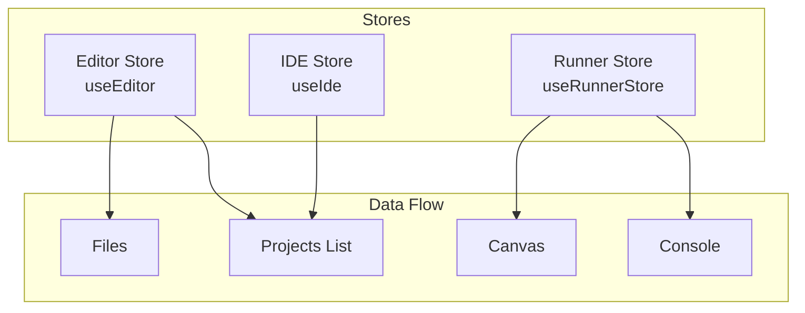
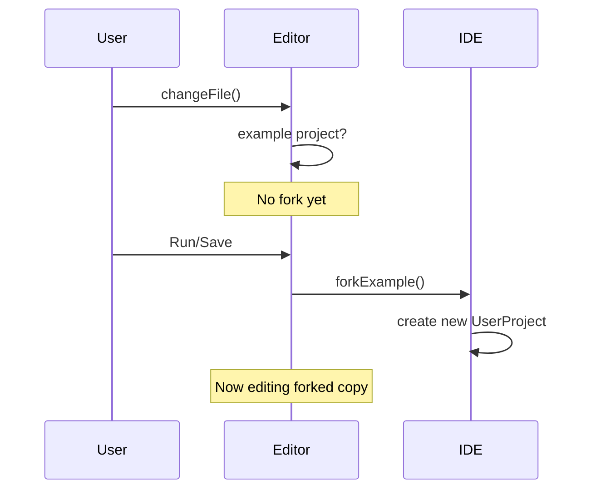

# State Management Specification

**Module:** state
**File:** `src/state/IdeState.ts`

---

## 1. Overview

The state management uses **Zustand** for lightweight, React 19-compatible state management. There are three primary stores:

### 1.1 Store Architecture



---

## 2. Editor Store

### 2.1 State Shape

```typescript
interface EditorState {
  currentFile: string;
  project: Project;
  currentProjectId: string | null;
  dirtyFiles: Set<string>;
  lastSaveTime: number;
}
```

### 2.2 Project Type

```typescript
interface Project {
  files: Record<string, string>;    // filename → content
  currentFile?: string;            // active file
  assets: Record<string, string>;  // asset name → dataURL
}
```

### 2.3 Actions

| Action | Signature | Description |
|--------|-----------|-------------|
| changeCurrentFile | `(name: string) => void` | Switch active file |
| changeCurrentProject | `(project: Project, projectId?: string) => void` | Load project |
| changeFile | `(name: string, text: string) => void` | Update file content |
| saveFile | `(name: string) => void` | Mark file as saved |
| deleteFile | `(name: string) => void` | Remove file |
| changeAsset | `(name: string, url: string) => void` | Add/change asset |
| toggleAsset | `(name: string, url: string) => void` | Add/remove asset |
| renameFile | `(oldName: string, newName: string) => void` | Rename file |
| markClean | `() => void` | Clear dirtyFiles set |
| updateLastSaveTime | `() => void` | Update timestamp |

### 2.4 Auto-Fork Behavior



When editing an **example** (no `currentProjectId`), the `changeFile` action does NOT fork automatically. Instead:

1. The example project is shared by reference
2. `dirtyFiles` tracks which files have changed
3. When user clicks Run or saves, the project is forked via `forkExample()`

This allows editing examples without immediately creating user projects.

---

## 3. IDE Store

### 3.1 State Shape

```typescript
interface IdeState {
  activePanel: PanelId;
  assets: Record<string, Blob>;
  projects: Record<string, Project>;
  userProjects: UserProject[];
  loading: boolean;
  showHitboxes: boolean;
}

type PanelId = "projects" | "assets" | "settings" | null;
```

### 3.2 UserProject Type

```typescript
interface StoredProject extends Project {
  id: string;
  name: string;
  createdAt: string;
  updatedAt: string;
  isExample: boolean;
  currentFile?: string;
}
```

### 3.3 Built-in Examples

```typescript
const Examples: Record<string, Project> = {
  "hello world": { files: { "main.py": HelloWorld }, assets: {} },
  input: { files: { "input.py": Input }, assets: {} },
  p5: { files: { "p5.py": P5 }, assets: {} },
  snake: {
    files: { "snake.py": Snake, "snake_cfg.py": SnakeCfg, "apple_cfg.py": AppleCfg },
    assets: {}
  },
  sokoban: {
    files: { "sokoban.py": Sokoban },
    assets: pickAssets("grassCenter", "castleCenter", "boxEmpty", "boxCoinAlt", "star", "p1_front")
  },
  asteroids: {
    files: { "main.py": Asteroids },
    assets: { "ship.svg": ShipSvg, "bullet.svg": BulletSvg, "big_asteroid.svg": BigAsteroidSvg, "small_asteroid.svg": SmallAsteroidSvg }
  }
};
```

### 3.4 Actions

| Action | Signature | Description |
|--------|-----------|-------------|
| setActivePanel | `(panel: PanelId) => void` | Open specific panel |
| togglePanel | `(panel: Exclude<PanelId, null>) => void` | Toggle panel open/close |
| closePanels | `() => void` | Close all panels |
| setShowHitboxes | `(show: boolean) => void` | Toggle hitbox visibility |
| loadUserProjects | `async () => Promise<void>` | Load from IndexedDB |
| createNewProject | `async (name: string) => Promise<UserProject>` | Create new project |
| deleteUserProject | `async (id: string) => Promise<void>` | Delete project |
| renameUserProject | `async (id: string, newName: string) => Promise<void>` | Rename project |
| forkExample | `async (name: string, project: Project, newName?: string) => Promise<UserProject>` | Fork example |
| saveCurrentProject | `async () => Promise<void>` | Save current project to IndexedDB |
| exportProject | `async (id: string) => Promise<void>` | Export as ZIP |
| downloadProject | `async (id: string) => Promise<void>` | Download project ZIP |
| importProject | `async (zipData: ArrayBuffer, name?: string) => Promise<UserProject>` | Import from ZIP |
| importProjectFromFile | `async (file: File) => Promise<UserProject>` | Import from File |

---

## 4. Runner Store

**File:** `src/runner/RunnerProvider.tsx`

### 4.1 State Shape

```typescript
interface RunnerState {
  ready: boolean;
  running: boolean;
  output: OutputLine[];
  inputPrompt: string | null;
  isP5: boolean;
  canvasActive: boolean;
  lintErrors: LintDiagnostic[];
}
```

### 4.2 OutputLine Type

```typescript
interface OutputLine {
  kind: "stdout" | "stderr";
  text: string;
}
```

### 4.3 LintDiagnostic Type

```typescript
interface LintDiagnostic {
  code: string;                    // e.g., "E999", "F821"
  messageKey: string;             // e.g., "linter.E225"
  messageArgs: Record<string, string | number>;
  row: number;                    // 0-indexed
  column: number;
  endRow: number;
  endColumn: number;
  severity: "error";
}
```

### 4.4 Actions

| Action | Signature | Description |
|--------|-----------|-------------|
| _onMessage | `(msg: WorkerEvent) => void` | Handle worker message |
| _appendOutput | `(kind, text) => void` | Add output line |
| setRunning | `(running: boolean) => void` | Set running state |
| clear | `() => void` | Clear all output |
| stop | `() => void` | Stop execution |
| respondToInput | `(value: string) => void` | Respond to input prompt |
| setLintErrors | `(errors: LintDiagnostic[]) => void` | Set lint errors |

---

## 5. Message Handling

### 5.1 Worker Events

```typescript
type WorkerEvent =
  | { type: "ready" }
  | { type: "start"; isP5: boolean; canvasActive: boolean }
  | { type: "stdout"; text: string }
  | { type: "stderr"; text: string }
  | { type: "result" }
  | { type: "error"; error: string }
  | { type: "input_request"; prompt: string }
  | { type: "lint"; diagnostics: LintDiagnostic[] }
  | { type: "interrupt_ack" };
```

### 5.2 Event Flow

```
Worker posts message
    ↓
useRunnerStore._onMessage(msg)
    ↓
match msg.type:
  - "ready": set ready=true
  - "stdout"/"stderr": _appendOutput → output batching
  - "result": running=false, canvasActive=false
  - "error": running=false, append stderr
  - "input_request": show input prompt
  - "lint": setLintErrors + append to output
  - "start": set running, isP5, canvasActive
```

### 5.3 Output Batching

```typescript
let outputQueue: OutputLine[] = [];
let flushHandle: number | null = null;

function scheduleFlush() {
  if (flushHandle !== null) return;
  flushHandle = requestAnimationFrame(() => {
    flushHandle = null;
    // Batch stdout/stderr lines before dispatch
    const stdoutLines = outputQueue.filter(l => l.kind === "stdout").map(l => l.text);
    const stderrLines = outputQueue.filter(l => l.kind === "stderr").map(l => l.text);
    outputQueue = [];
    // Dispatch as single lines
  });
}
```

---

## 6. Selector Pattern

All stores use Zustand's selector pattern for efficient re-renders:

```typescript
// Subscribe to single value
const currentFile = useEditor(s => s.currentFile);

// Subscribe to computed
const hasUnsavedChanges = useEditor(s => s.dirtyFiles.size > 0);

// Multiple selectors
const { running, isP5 } = useRunner();
// or
const { running, isP5 } = useRunnerStore();
```

---

## 7. Shared State Access

Some components need to access multiple stores. Direct access is preferred:

```typescript
// Direct access (preferred for one-off reads)
const currentProjectId = useEditor.getState().currentProjectId;
const userProjects = useIde.getState().userProjects;

// In callbacks
saveCurrentProject: async () => {
  const { currentProjectId, project } = useEditor.getState();
  const { userProjects } = useIde.getState();
  // ...
}
```

---

*End of State Management Specification*