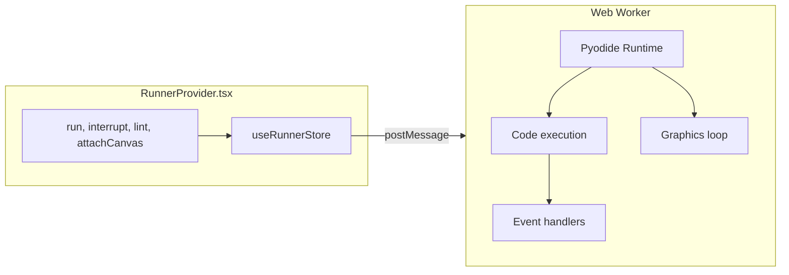

# Runner Module Specification

**Module:** runner
**Files:** `src/runner/RunnerProvider.tsx`, `src/runner/worker.ts`, `src/runner/WorkerInterface.ts`

---

## 1. Overview

The Runner module manages the Python WebWorker that executes user code. It handles:
- Pyodide initialization
- Code execution (plain Python, p5, new graphics)
- Linting
- Event injection (mouse, keyboard)
- Asset loading
- Interrupt/stop functionality



---

## 2. WorkerInterface Types

### 2.1 WorkerCommand (Main → Worker)

```typescript
type WorkerCommand =
  | { cmd: "init"; shim: string; transform: string; actors: string; graphicsInit: string; graphicsActors: string; graphicsActorsConfig: string; linter: string }
  | { cmd: "run"; files: Record<string, string>; assets: Record<string, ImageBitmap>; entry: string; showHitboxes?: boolean }
  | { cmd: "interrupt" }
  | { cmd: "set_interrupt_buffer"; buffer: SharedArrayBuffer }
  | { cmd: "attach_canvas"; canvas: OffscreenCanvas }
  | { cmd: "event"; kind: WorkerEventType; data: InputEventData }
  | { cmd: "input_response"; value: string }
  | { cmd: "lint"; code: string; filename: string };
```

### 2.2 WorkerEventType

```typescript
type WorkerEventType = "mousemove" | "mousedown" | "mouseup" | "keydown" | "keyup";
```

### 2.3 InputEventData

```typescript
type InputEventData = {
  x?: number;
  y?: number;
  button?: number;
  key?: string;
  keyCode?: number;
};
```

### 2.4 WorkerEvent (Worker → Main)

```typescript
type WorkerEvent =
  | { type: "ready" }
  | { type: "start"; isP5: boolean; canvasActive: boolean }
  | { type: "stdout"; text: string }
  | { type: "stderr"; text: string }
  | { type: "result" }
  | { type: "error"; error: string }
  | { type: "input_request"; prompt: string }
  | { type: "lint"; diagnostics: LintDiagnostic[] }
  | { type: "interrupt_ack" };
```

### 2.5 LintDiagnostic

```typescript
type LintDiagnostic = {
  code: string;
  messageKey: string;
  messageArgs: Record<string, string | number>;
  row: number;
  column: number;
  endRow: number;
  endColumn: number;
  severity: "error";
};
```

---

## 3. RunnerProvider

### 3.1 Public API

```typescript
export function useRunner() {
  return {
    ready: boolean;
    running: boolean;
    isP5: boolean;
    canvasActive: boolean;
    output: OutputLine[];
    run: (files, assets, entry) => Promise<void>;
    interrupt: () => Promise<void>;
    clear: () => void;
    attachCanvas: (el: HTMLCanvasElement | null) => void;
    inputPrompt: string | null;
    respondToInput: (value: string) => void;
    lint: (code: string, filename: string) => Promise<LintDiagnostic[]>;
    lintErrors: LintDiagnostic[];
    _appendOutput: (kind, text) => void;
  };
}
```

### 3.2 Worker Singleton

```typescript
let worker: Worker | null = null;

function getWorker(): Worker {
  if (worker) return worker;
  worker = new Worker(new URL("./worker.ts", import.meta.url), { type: "module" });
  // Set up onmessage handler
  // Initialize interrupt buffer
  // Post init command with code
  return worker;
}
```

### 3.3 Asset Loading

Assets are loaded in the main thread and transferred as ImageBitmaps:

```typescript
const loadAssets = useCallback(async (assets: Record<string, string>) => {
  const bitmaps: Record<string, ImageBitmap> = {};
  const transferables: ImageBitmap[] = [];

  await Promise.all(
    Object.entries(assets).map(async ([name, url]) => {
      if (url.startsWith("data:")) {
        // SVG data URLs
        const img = new Image();
        await img.loaded;
        const canvas = document.createElement("canvas");
        canvas.width = img.width;
        canvas.height = img.height;
        const ctx = canvas.getContext("2d")!;
        ctx.drawImage(img, 0, 0);
        const bitmap = await createImageBitmap(canvas);
        bitmaps[name] = bitmap;
        transferables.push(bitmap);
      } else {
        // Regular URLs
        const res = await fetch(url);
        const blob = await res.blob();
        const bitmap = await createImageBitmap(blob);
        bitmaps[name] = bitmap;
        transferables.push(bitmap);
      }
    })
  );

  return { bitmaps, transferables };
}, []);
```

### 3.4 Canvas Attachment

Canvas is transferred to worker as OffscreenCanvas:

```typescript
const attachCanvas = useCallback((el: HTMLCanvasElement | null) => {
  cleanupEvents?.();
  cleanupEvents = null;
  if (!el) return;

  if (!canvasTransferred) {
    const offscreen = el.transferControlToOffscreen();
    getWorker().postMessage(
      { cmd: "attach_canvas", canvas: offscreen },
      [offscreen]  // Transfer ownership
    );
    canvasTransferred = true;
  }

  cleanupEvents = wireEvents(el);
}, []);
```

### 3.5 Interrupt Mechanism

```typescript
const interrupt = useCallback((): Promise<void> => {
  return new Promise((resolve) => {
    const worker = getWorker();

    const handleMessage = (e: MessageEvent) => {
      if (e.data?.type === "interrupt_ack") {
        worker.removeEventListener("message", handleMessage);
        resolve();
      }
    };

    worker.addEventListener("message", handleMessage);
    worker.postMessage({ cmd: "interrupt" });

    // SharedArrayBuffer interrupt (faster than message)
    if (interruptBuffer) {
      interruptBuffer[0] = 2;  // Signal interrupt
      setTimeout(() => { interruptBuffer![0] = 0; }, 100);
    }

    useRunnerStore.getState().stop();

    // Fallback timeout
    setTimeout(() => {
      worker.removeEventListener("message", handleMessage);
      resolve();
    }, 100);
  });
}, []);
```

---

## 4. Worker (worker.ts)

### 4.1 Initialization

```typescript
async function initPyodide(
  p: PyodideInterface,
  shim: string,
  transform: string,
  actors: string,
  graphicsInit: string,
  graphicsActors: string,
  graphicsActorsConfig: string,
  linter: string,
) {
  // Write modules to filesystem
  p.FS.writeFile("/_shim_p5.py", shim);
  p.FS.writeFile("/transform.py", transform);
  p.FS.writeFile("/actors.py", actors);
  p.FS.mkdir("/graphics");
  p.FS.mkdir("/graphics/actors");
  p.FS.writeFile("/graphics/__init__.py", graphicsInit);
  p.FS.writeFile("/graphics/actors/__init__.py", graphicsActors);
  p.FS.writeFile("/graphics/actors/config.py", graphicsActorsConfig);
  p.FS.writeFile("/linter.py", linter);

  // Set up I/O callbacks
  p.globals.set("_ide_post_output", (kind, text) => {
    post({ type: kind, text });
  });
  p.globals.set("_ide_post_input_request", (prompt) => {
    post({ type: "input_request", prompt });
  });

  // Initialize Python modules
  await p.runPythonAsync(`
    import sys
    sys.path.insert(0, "/")
    import _shim_p5 as _shim
    _shim._ide_init(_ide_post_output, _ide_post_input_request)
    import linter
  `);
}
```

### 4.2 Pyodide Loading

```typescript
async function ensurePyodide(): Promise<PyodideInterface> {
  if (pyodide) return pyodide;

  const CDN = "https://cdn.jsdelivr.net/pyodide/v0.26.4/full/";
  const local = new URL(`${import.meta.env?.BASE_URL ?? "/"}pyodide/`, self.location.origin).toString();

  for (const base of [local, CDN]) {
    try {
      const { loadPyodide } = await import(`${base}pyodide.mjs`);
      pyodide = await loadPyodide({ indexURL: base });
      return pyodide!;
    } catch {
      // Try next source
    }
  }
  throw new Error("Failed to load Pyodide");
}
```

### 4.3 Graphics Execution

```typescript
async function runGraphicsScript(
  p: PyodideInterface,
  files: Record<string, string>,
  assets: Record<string, ImageBitmap>,
  entry: string,
  showHitboxes: boolean = false,
) {
  prepareFiles(p, files);

  // Set assets
  const assetsEntries = Object.entries(assets);
  p.globals.set("_asset_bitmaps", assetsEntries);
  p.globals.set("_using_graphics", true);

  // Initialize graphics module
  await p.runPythonAsync(`
    import graphics
    graphics._init(__ide_canvas)

    # Clear state from previous runs
    from graphics.actors import Actor
    Actor._registry.clear()
    Actor._id_counter = 0
    graphics._loop_generation = graphics._loop_generation + 1
    graphics._show_hitboxes = ${showHitboxes ? "True" : "False"}

    from types import SimpleNamespace
    _sprites = _shim._ide_build_assets(_asset_bitmaps).sprites
    graphics.assets = SimpleNamespace(sprites=_sprites)
  `);

  // Reset running state
  await p.runPythonAsync(`
    graphics._running = False
    graphics._stop_requested = False
    graphics._loop_generation = graphics._loop_generation + 1
    graphics._every_handlers = {}
    graphics._key_handlers = {}
    graphics._mouse_handlers = []
    graphics._collision_handlers = []
    graphics._frame_count = 0
  `);

  // Run user code
  const code = files[entry] ?? "";
  post({ type: "start", isP5: false, canvasActive: true });

  try {
    await p.runPythonAsync(code);
  } catch (err) {
    post({ type: "error", error: String(err) });
    p.globals.set("_using_graphics", false);
    post({ type: "result" });
  }
}
```

### 4.4 p5 Execution

```typescript
async function runScript(
  p: PyodideInterface,
  files: Record<string, string>,
  assets: Record<string, ImageBitmap>,
  entry: string,
  showHitboxes: boolean = false,
) {
  const code = files[entry] ?? "";
  p.globals.set("_using_graphics", false);

  // Check if using new graphics API
  if (usesNewGraphics(code)) {
    await runGraphicsScript(p, files, assets, entry, showHitboxes);
    return;
  }

  // Transform code
  let transformed: string;
  let isP5: boolean;

  try {
    const result = p.runPython(
      `transform(${JSON.stringify(code)}, ${JSON.stringify(entry)})`
    ).toJs({ dict_converter: Object.fromEntries });
    transformed = result.code;
    isP5 = result.metadata.is_p5;
    post({ type: "start", isP5, canvasActive: isP5 });
  } catch (err) {
    post({ type: "error", error: `Transform failed: ${err}` });
    return;
  }

  if (isP5) {
    // Set up assets and run
    const assetsEntries = Object.entries(assets);
    p.globals.set("_asset_bitmaps", assetsEntries);
    await p.runPythonAsync(
      `assets = _shim._ide_build_assets(_asset_bitmaps.to_py())`
    );
    await p.runPythonAsync(
      `_shim._ide_run_p5(__ide_canvas, ${JSON.stringify(transformed)}, ${JSON.stringify(entry)}, assets)`
    );
  } else {
    // Plain Python
    await p.runPythonAsync(transformed);
  }

  post({ type: "result" });
}
```

### 4.5 Event Handling

```typescript
self.onmessage = async (e: MessageEvent<WorkerCommand>) => {
  const msg = e.data;

  if (msg.cmd === "event") {
    if (!pyodide) return;
    try {
      const usingGraphics = pyodide.globals.get("_using_graphics");
      if (usingGraphics) {
        pyodide.runPython(`graphics._inject_event("${msg.kind}", ${JSON.stringify(msg.data)})`);
      } else {
        const shim = pyodide.globals.get("_shim");
        shim?._inject_event(msg.kind, msg.data);
        shim?.destroy();
      }
    } catch {
      /* ignore */
    }
  }
};
```

---

## 5. Execution Modes

### 5.1 Plain Python (no graphics)

```
User code → transform() → wrap in MAIN() → exec()
```

Input calls are rewritten to `await console.ainput()`.

### 5.2 p5 Compatibility Mode

```
User code → has setup/draw? → _run_sketch()
```

Uses `shim.py` canvas API. Events injected via `_inject_event()`.

### 5.3 New Graphics Mode

```
User code → import graphics → g.run()
```

Uses `graphics/__init__.py` API with Actor system.

---

## 6. _loop_generation Invalidation

Old ticks are invalidated by incrementing `_loop_generation`:

```python
# Worker init: +1
_loop_generation = 0  # initial

# runGraphicsScript: +1
_loop_generation = graphics._loop_generation + 1  # Before user code

# g.run() internal: +1
_loop_generation += 1  # At start of _run_loop()
my_generation = _loop_generation  # Captured for this tick
```

Each run gets unique generations (3, 6, 9, 12...), preventing old ticks from executing in new runs.

---

## 7. SharedArrayBuffer Interrupt

For faster interrupt signaling, a SharedArrayBuffer is used:

```typescript
// Main thread
function initInterruptBuffer(w: Worker) {
  if (typeof SharedArrayBuffer === "undefined") return;
  const buffer = new SharedArrayBuffer(1);
  interruptBuffer = new Uint8Array(buffer);
  w.postMessage({ cmd: "set_interrupt_buffer", buffer });
}

// Worker
self.onmessage = (e) => {
  if (msg.cmd === "set_interrupt_buffer") {
    pyodide.setInterruptBuffer(new Uint8Array(msg.buffer));
  }
};

// Main thread - signal interrupt
interruptBuffer[0] = 2;  // 2 = interrupt signal
```

---

## 8. Key Constants

| Constant | Value | Description |
|----------|-------|-------------|
| PYODIDE_VERSION | 0.26.4 | Pyodide runtime version |
| CACHE_NAME | webide-v2 | Service worker cache |
| AUTO_SAVE_INTERVAL | 60000 | Auto-save interval (ms) |

---

*End of Runner Module Specification*