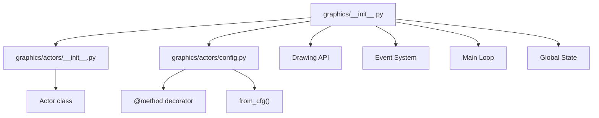

# Graphics Module Specification

**Module:** graphics (Python)
**Files:**
- `src/assets/python/graphics/__init__.py`
- `src/assets/python/graphics/actors/__init__.py`
- `src/assets/python/graphics/actors/config.py`

---

## 1. Overview

The graphics module (`g`) is a Python API for creating games and visualizations in the browser. It provides:
- Canvas drawing primitives (shapes, text, images)
- Event handling (keyboard, mouse)
- Actor-based game objects
- Collision detection
- Animation loop

**Import:** `import graphics as g`

### 1.1 Module Structure



---

## 2. Global State

```python
# Canvas
_canvas = None           # OffscreenCanvas
_ctx = None              # Canvas 2D context
_width = 300             # Canvas width
_height = 300            # Canvas height

# Running state
_running = False         # Loop active
_stop_requested = False  # Stop requested
_loop_generation = 0    # Tick generation

# Draw queue
_draw_commands = []      # Deferred draw operations
_pending_size = None    # Pending canvas resize

# Color state
_fill_color = (255, 255, 255)
_stroke_color = (0, 0, 0)
_stroke_width = 1
_current_fill = True
_current_stroke = True

# Setup
_setup_func = None       # User's setup() function

# Event handlers
_key_handlers = {}       # key → [handlers]
_mouse_handlers = []    # [("move"|"click", handler)]
_every_handlers = {}     # frames → [[counter, handler]]
_collision_handlers = [] # [(actor_class, handler)]

# Input state
_mouse_x = 0
_mouse_y = 0
_keys_down = set()

# Frame state
_frame_count = 0
_target_fps = 60
_pending_timer_id = None
_show_hitboxes = False

# Assets
assets = None  # SimpleNamespace with sprites
```

---

## 3. Color System

### 3.1 COLOR_NAMES

```python
COLOR_NAMES = {
    "red": (255, 0, 0),
    "green": (0, 255, 0),
    "blue": (0, 0, 255),
    "yellow": (255, 255, 0),
    "cyan": (0, 255, 255),
    "magenta": (255, 0, 255),
    "white": (255, 255, 255),
    "black": (0, 0, 0),
    "gray": (128, 128, 128),
    "grey": (128, 128, 128),
    "orange": (255, 165, 0),
    "purple": (128, 0, 128),
    "pink": (255, 192, 203),
    "brown": (139, 69, 19),
    "lime": (0, 255, 0),
    "navy": (0, 0, 128),
    "teal": (0, 128, 128),
    "olive": (128, 128, 0),
    "maroon": (128, 0, 0),
    "silver": (192, 192, 192),
    "aqua": (0, 255, 255),
    "fuchsia": (255, 0, 255),
}
```

### 3.2 Key Codes

```python
_KEY_CODES = {
    "arrow_left": 37,
    "arrow_up": 38,
    "arrow_right": 39,
    "arrow_down": 40,
    "space": 32,
    "escape": 27,
    "enter": 13,
    "backspace": 8,
    "tab": 9,
    "shift": 16,
    "ctrl": 17,
    "alt": 18,
    "a": 65, "b": 66, ... "z": 90,
    "0": 48, "1": 49, ... "9": 57,
}
```

---

## 4. Drawing API

### 4.1 Canvas Setup

| Function | Signature | Description |
|----------|-----------|-------------|
| size | `size(w: int, h: int) → None` | Set canvas dimensions |
| width | `width() → int` | Get canvas width |
| height | `height() → int` | Get canvas height |

### 4.2 Shapes

| Function | Signature | Description |
|----------|-----------|-------------|
| circle | `circle(x, y, r)` | Draw circle |
| rect | `rect(x, y, w, h)` | Draw rectangle |
| ellipse | `ellipse(x, y, w, h=None)` | Draw ellipse (w=h if h None) |
| line | `line(x1, y1, x2, y2)` | Draw line |
| point | `point(x, y)` | Draw point |

### 4.3 Text

| Function | Signature | Description |
|----------|-----------|-------------|
| text | `text(s, x, y)` | Draw text string |
| text_size | `text_size(n)` | Set font size (px) |
| text_align | `text_align(h, v=None)` | Set alignment (left/center/right, top/bottom) |

### 4.4 Color

| Function | Signature | Description |
|----------|-----------|-------------|
| fill | `fill(r, g=None, b=None)` | Set fill color (0-255 or name string) |
| no_fill | `no_fill()` | Disable fill |
| stroke | `stroke(r, g=None, b=None)` | Set stroke color |
| no_stroke | `no_stroke()` | Disable stroke |
| stroke_width | `stroke_width(w)` | Set stroke width |
| background | `background(r, g=None, b=None)` | Clear canvas with color |

**Fill/Stroke with strings:**
```python
g.fill("red")        # Named color
g.fill(255, 0, 0)   # RGB
g.fill(128)         # Grayscale
g.fill(None)        # Disable fill (same as no_fill())
```

### 4.5 Transform

| Function | Signature | Description |
|----------|-----------|-------------|
| push | `push()` | Save canvas state (translate, rotate, scale) |
| pop | `pop()` | Restore canvas state |
| translate | `translate(x, y)` | Move origin |
| rotate | `rotate(angle)` | Rotate (degrees) |
| scale | `scale(x, y=None)` | Scale (uniform if y None) |

### 4.6 Image

| Function | Signature | Description |
|----------|-----------|-------------|
| image | `image(img, x, y, w=None, h=None)` | Draw image (from assets) |
| image_mode | `image_mode(mode)` | Set mode (corner/center) |
| rect_mode | `rect_mode(mode)` | Set mode (corner/center) |

---

## 5. Input API

### 5.1 State Functions

| Function | Signature | Description |
|----------|-----------|-------------|
| key_pressed | `key_pressed(key: str) → bool` | Check if key is down |
| mouse_x | `mouse_x() → float` | Mouse X position |
| mouse_y | `mouse_y() → float` | Mouse Y position |

### 5.2 Control Functions

| Function | Signature | Description |
|----------|-----------|-------------|
| frame_rate | `frame_rate(fps)` | Set target FPS |
| random | `random(low, high=None) → float` | Random float |
| random_color | `random_color() → str` | Random color name |

---

## 6. Event System

### 6.1 Decorators

```python
@g.every(frames: int)
@g.on_key_press(*keys: str)
@g.on_mouse_move
@g.on_mouse_click
@g.setup
@g.on_collide(actor_class)
@g.on_collide_any(*actor_classes)
```

### 6.2 Example Usage

```python
@g.every(5)
def tick():
    player.move_forward(1)

@g.on_key_press("w", "arrow_up")
def go_up():
    player.direction = "up"

@g.on_mouse_move
def on_mouse_move(x, y):
    cursor.set_coords(x, y)

@g.on_mouse_click
def on_click(x, y):
    spawn_bullet(x, y)

@g.setup
def init():
    g.size(400, 400)
    g.background("black")

@g.on_collide(Bullet)
def on_hit(bullet, other):
    other.die()
    bullet.die()
```

### 6.3 Mouse Handler Signatures

Mouse handlers receive `(x, y)` coordinates:
```python
@g.on_mouse_move
def on_move(x, y):
    print(f"Mouse at {x}, {y}")

@g.on_mouse_click
def on_click(x, y):
    print(f"Clicked at {x}, {y}")
```

---

## 7. Drawing Pipeline

Draw commands are accumulated and executed each frame:

```python
def circle(x, y, r):
    _draw_commands.append(("circle", (float(x), float(y), float(r)), {}))

def _execute_draw_commands():
    global _ctx
    for cmd, args, kwargs in _draw_commands:
        if cmd == "circle":
            x, y, r = args
            _ctx.beginPath()
            _ctx.arc(x, y, r, 0, math.pi * 2)
            if _current_fill:
                _ctx.fill()
            if _current_stroke:
                _ctx.stroke()
        # ... more commands
```

---

## 8. Main Loop

```python
def _run_loop():
    global _running, _loop_generation, _frame_count
    _running = True
    _loop_generation += 1  # Invalidate old ticks
    my_generation = _loop_generation
    _frame_count = 0

    def tick():
        if _loop_generation != my_generation:
            return  # Old tick - skip
        if not _running:
            return
        if _stop_requested:
            _running = False
            return

        try:
            _execute_draw_commands()
            _draw_commands.clear()
            _check_collisions()

            # Execute @every handlers
            for frames, handlers in _every_handlers.items():
                for item in handlers:
                    counter, func = item
                    counter += 1
                    if counter >= frames:
                        func()
                        counter = 0
                    item[0] = counter

            _frame_count += 1
        except Exception:
            traceback.print_exc()
            _running = False
            return

        # Schedule next tick
        elapsed = 1000 / _target_fps
        setTimeout(tick_proxy, int(elapsed))

    tick_proxy = create_proxy(tick)
    tick()
```

---

## 9. Actor System

### 9.1 Actor Class

```python
class Actor:
    _registry = []      # All actors
    _id_counter = 0     # Auto-increment

    # Internal state
    _x = 0.0           # X position
    _y = 0.0           # Y position
    _angle = 0.0       # Rotation (degrees)
    _vx = 0.0          # Velocity X
    _vy = 0.0          # Velocity Y
    _visible = True    # Visibility
    _collidable = True # Can collide
    _alive = True      # Is alive

    # Custom state
    _state = {}        # Extra properties

    # Methods
    image = None        # Sprite image
    _update_func = None
    _draw_func = None
```

### 9.2 Actor Properties (read-only)

| Property | Type | Description |
|----------|------|-------------|
| x | float | X position |
| y | float | Y position |
| angle | float | Rotation angle |

### 9.3 Actor Methods

| Method | Signature | Description |
|--------|-----------|-------------|
| set_coords | `set_coords(x, y)` | Set position |
| get_coords | `get_coords() → (x, y)` | Get position |
| get_x | `get_x() → float` | Get X |
| get_y | `get_y() → float` | Get Y |
| point_to | `point_to(x, y)` | Point at coordinate |
| move_forward | `move_forward(distance)` | Move in facing direction |
| move_left | `move_left(distance)` | Move left |
| move_right | `move_right(distance)` | Move right |
| move_up | `move_up(distance)` | Move up |
| move_down | `move_down(distance)` | Move down |
| set_speed | `set_speed(vx, vy)` | Set velocity |
| get_speed | `get_speed() → (vx, vy)` | Get velocity |
| move | `move(distance)` | Move with velocity or forward |
| rotate_clockwise | `rotate_clockwise(degrees)` | Rotate |
| get_angle | `get_angle() → float` | Get angle |
| set_angle | `set_angle(degrees)` | Set angle |
| hide | `hide()` | Make invisible and non-collidable |
| ghost | `ghost()` | Make visible but non-collidable |
| die | `die()` | Mark dead, remove from registry |
| is_alive | `is_alive() → bool` | Check alive |
| bring_to_front | `bring_to_front()` | Move to end of registry |
| send_to_back | `send_to_back()` | Move to start of registry |
| collides_with | `collides_with(other) → bool` | Check collision |

### 9.4 Static Methods

| Method | Signature | Description |
|--------|-----------|-------------|
| all_actors | `all_actors() → list[Actor]` | Get all actors |
| random_coords | `random_coords() → (x, y)` | Random position on canvas |
| from_cfg | `from_cfg(module) → Actor` | Create from config module |

### 9.5 Creating Actors

**Direct Constructor:**
```python
def draw_fn(self):
    g.fill(255, 0, 0)
    g.circle(self.x, self.y, 20)

player = Actor(x=100, y=100, draw=draw_fn)
```

**Config-based (from_cfg):**
```python
# snake_cfg.py
from graphics.actors.config import method

x = 10  # initial position
y = 10
direction = "up"

@method
def draw(self):
    g.fill(0, 255, 0)
    g.rect(self.x, self.y, 20, 20)

@method
def update(self):
    if self.direction == "right":
        self.x += 1

# main.py
import snake_cfg
snake = Actor.from_cfg(snake_cfg)
```

---

## 10. @method Decorator

### 10.1 Purpose

The `@method` decorator marks functions in a config module that should become actor methods.

### 10.2 Usage

```python
from graphics.actors.config import method

@method
def draw(self):
    # 'self' is the actor instance
    g.fill("green")
    g.circle(self.x, self.y, 10)

@method
def update(self):
    # Move in facing direction
    self.move_forward(1)
```

### 10.3 from_cfg Implementation

```python
def from_cfg(module):
    methods = {}
    initial_state = {}
    coords = None

    for name in dir(module):
        obj = getattr(module, name)
        if callable(obj) and getattr(obj, "_is_actor_method", False):
            methods[name] = obj
        elif not callable(obj):
            if name in ("x", "y"):
                # Capture coords for set_coords()
                coords = ...
            else:
                initial_state[name] = obj

    actor = Actor(**initial_state)
    for name, func in methods.items():
        bound_method = MethodType(func, actor)
        setattr(actor, name, bound_method)

    if coords:
        actor.set_coords(coords[0], coords[1])

    return actor
```

---

## 11. Collision System

### 11.1 Collision Detection

**Circle vs Circle:**
```python
dx = self._x - other._x
dy = self._y - other._y
dist_sq = dx*dx + dy*dy
radius_sum = self.radius + other.radius
return dist_sq < radius_sum * radius_sum
```

**Rectangle vs Rectangle:**
```python
# AABB intersection
return ax < bx + bw and ax + aw > bx and ay < by + bh and ay + ah > by
```

### 11.2 Collision Handlers

```python
@g.on_collide(Bullet)
def on_bullet_hit(bullet, other):
    other.die()
    bullet.die()

@g.on_collide_any(Enemy, Obstacle)
def on_collision(actor, other):
    actor.bounce()
```

---

## 12. Hitbox Debugging

When `_show_hitboxes` is True, actors draw their hitboxes:

```python
def _draw_hitbox(self):
    if hasattr(self, "radius"):
        graphics.circle(x, y, self.radius)
    else:
        # Use image dimensions
        graphics.no_fill()
        graphics.stroke(255, 0, 0)
        graphics.rect(x - w/2, y - h/2, w, h)
```

---

## 13. Complete API Reference

### Drawing
- `size(w, h)` - Set canvas size
- `width()` - Get width
- `height()` - Get height
- `circle(x, y, r)` - Circle
- `rect(x, y, w, h)` - Rectangle
- `ellipse(x, y, w, h=None)` - Ellipse
- `line(x1, y1, x2, y2)` - Line
- `point(x, y)` - Point
- `text(s, x, y)` - Text
- `text_size(n)` - Font size
- `text_align(h, v=None)` - Alignment

### Color
- `fill(r, g=None, b=None)` - Fill color
- `no_fill()` - No fill
- `stroke(r, g=None, b=None)` - Stroke color
- `no_stroke()` - No stroke
- `stroke_width(w)` - Stroke width
- `background(r, g=None, b=None)` - Clear

### Transform
- `push()` - Save state
- `pop()` - Restore state
- `translate(x, y)` - Move origin
- `rotate(angle)` - Rotate
- `scale(x, y=None)` - Scale

### Image
- `image(img, x, y, w=None, h=None)` - Draw image
- `image_mode(mode)` - Mode (corner/center)
- `rect_mode(mode)` - Mode (corner/center)

### Input
- `key_pressed(key)` - Key down check
- `mouse_x()` - Mouse X
- `mouse_y()` - Mouse Y
- `frame_rate(fps)` - Set FPS
- `random(low, high=None)` - Random float
- `random_color()` - Random color name

### Events
- `@every(frames)` - Frame interval
- `@on_key_press(*keys)` - Key press
- `@on_mouse_move` - Mouse move
- `@on_mouse_click` - Mouse click
- `@setup` - Setup function
- `@on_collide(Class)` - Collision with type
- `@on_collide_any(*Classes)` - Collision with any

### Run
- `run()` - Start game loop
- `stop()` - Stop game loop

---

*End of Graphics Module Specification*