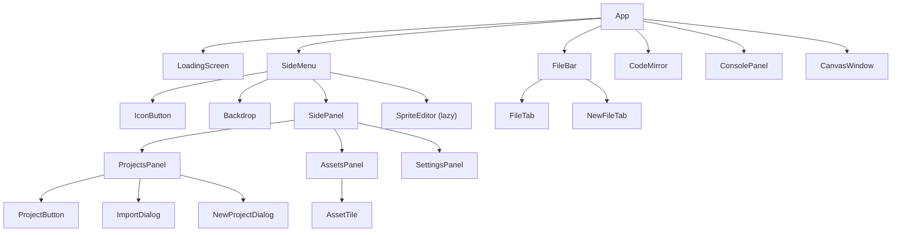

# UI Components Specification

**Module:** components
**Files:** Various in `src/components/` and root level

---

## 1. Component Hierarchy



---

## 2. App Component

**File:** `src/App.tsx`

### 2.1 Purpose
Root layout orchestrating all major UI regions.

### 2.2 State Dependencies
- `useEditor`: currentFile, project, dirtyFiles
- `useIde`: saveCurrentProject
- `useRunner`: ready

### 2.3 Features
- Service Worker registration (`/sw.js`)
- Ctrl+S keyboard shortcut
- CodeMirror editor with Python mode
- Soft line wrapping
- Indentation guide coloring

### 2.4 Render Logic
```tsx
if (!ready) {
  return <LoadingScreen />;
}

return (
  <div className="flex w-screen h-screen overflow-hidden bg-cyan-950">
    <Rail />                                    // SideMenu
    <div className="flex-1 min-w-0 min-h-0 flex flex-col">
      <FileBar />
      <CodeMirror />                            // Editor
    </div>
    <ConsolePanel />
    <CanvasWindow />
  </div>
);
```

---

## 3. SideMenu Component

**File:** `src/SideMenu.tsx`

### 3.1 Purpose
Navigation rail with collapsible panels for Projects, Assets, and Settings.

### 3.2 Sub-components
- ProjectsPanel - Example list + user projects
- AssetsPanel - Selected/available sprite assets
- SettingsPanel - Auto-save, Vim mode, hitboxes toggles

### 3.3 Rail Icons
| Icon | Label | Action |
|------|-------|--------|
| project.svg | Projects | togglePanel("projects") |
| play.svg/stop.svg | Run/Stop | handleRunToggle() |
| assets.svg | Assets | togglePanel("assets") |
| settings.svg | Settings | togglePanel("settings") |

### 3.4 State Dependencies
```typescript
const saveCurrentProject = useIde(s => s.saveCurrentProject);
const importProjectFromFile = useIde(s => s.importProjectFromFile);
const showHitboxes = useIde(s => s.showHitboxes);
const setShowHitboxes = useIde(s => s.setShowHitboxes);
const toggleAsset = useEditor(s => s.toggleAsset);
const project = useEditor(s => s.project);
const currentProjectId = useEditor(s => s.currentProjectId);
const dirtyFiles = useEditor(s => s.dirtyFiles);
const changeEditorCurrentProject = useEditor(s => s.changeCurrentProject);
const markClean = useEditor(s => s.markClean);
```

### 3.5 Key Features
- Lazy-loaded SpriteEditor (React.lazy)
- Projects auto-fork on edit when no currentProjectId
- Asset selection toggles assets in project
- Auto-save on 60-second interval
- Import/Export project as ZIP

---

## 4. FileBar Component

**File:** `src/FileBar.tsx`

### 4.1 Purpose
Tab bar for open files with create/rename/delete functionality.

### 4.2 Sub-components

#### FileTab Props
```typescript
interface FileTabProps {
  name: string;
}
```

#### FileTab Features
- Click to select file
- Double-click to rename (inline edit)
- Close button (×) with confirmation dialog
- Dirty indicator (yellow dot) for unsaved changes
- Shows filename, truncates if too long

#### NewFileTab
- Creates new `untitled.py` file
- Inline editing for filename
- Enter to confirm, Escape to cancel

### 4.3 Rename Logic
```typescript
const commitRename = () => {
  const trimmed = draft.trim();
  if (!trimmed || trimmed === name) {
    setEditing(false);
    return;
  }
  const content = project.files[name];
  deleteFile(name);
  const target = project.files[trimmed] ? trimmed + "_new" : trimmed;
  changeFile(target, content);
  changeCurrentFile(target);
};
```

---

## 5. ConsolePanel Component

**File:** `src/components/ConsolePanel.tsx`

### 5.1 Purpose
Display program output and handle input prompts.

### 5.2 Features
- Color-coded output:
  - stdout: `text-green-400` (green)
  - stderr: `text-red-400` (red)
- Copy to clipboard button
- Clear console button
- Input prompt when Python requests `input()`
- Auto-scroll to bottom on new output

### 5.3 Input Prompt
```tsx
{inputPrompt !== null && (
  <div className="flex items-center border border-cyan-600 rounded-lg px-3 py-2.5 mt-3 bg-cyan-800">
    <span className="text-green-400 whitespace-pre font-medium font-mono text-sm">
      {inputPrompt}
    </span>
    <input
      value={inputValue}
      onChange={(e) => setInputValue(e.target.value)}
      onKeyDown={(e) => { if (e.key === "Enter") submit(); }}
      // ...
    />
  </div>
)}
```

### 5.4 Output Batching
Output is batched via `requestAnimationFrame` in RunnerProvider, then flushed to this component.

---

## 6. CanvasWindow Component

**File:** `src/CanvasWindow.tsx`

### 6.1 Purpose
Floating, draggable canvas for graphics output.

### 6.2 Features
- Fixed position (right: 2rem, bottom: 2rem)
- Draggable via title bar (pointer events)
- Shows only when `canvasActive === true` (opacity transition)
- OffscreenCanvas transfer for GPU rendering

### 6.3 Drag Implementation
```typescript
const dragState = useRef<{
  startX: number;
  startY: number;
  baseX: number;
  baseY: number;
} | null>(null);

const onPointerDown = (e) => {
  dragState.current = {
    startX: e.clientX,
    startY: e.clientY,
    baseX: pos.x,
    baseY: pos.y,
  };
  (e.target as HTMLElement).setPointerCapture(e.pointerId);
};

const onPointerMove = (e) => {
  if (!dragState.current) return;
  setPos({
    x: dragState.current.baseX + e.clientX - dragState.current.startX,
    y: dragState.current.baseY + e.clientY - dragState.current.startY,
  });
};
```

---

## 7. SpriteEditor Component

**File:** `src/SpriteEditor.tsx`

### 7.1 Purpose
Konva-based vector sprite editor for creating SVG sprites.

### 7.2 Tools

| Tool | Icon | Behavior |
|------|------|----------|
| select | MdNorthWest | Click to select, drag to move/resize |
| rect | MdCropSquare | Click+drag to create rectangle |
| ellipse | MdCircle | Click+drag to create ellipse |
| line | MdLineAxis | Click start, click end (double-click to finish) |
| freehand | MdEdit | Draw path, release to finish (auto-close if near start) |
| polygon | MdPolyline | Click to add vertices, Enter/double-click to close |
| text | MdTextFields | Prompt for text, place at click position |

### 7.3 State

```typescript
const [shapes, setShapes] = useState<ShapeData[]>([]);
const [history, setHistory] = useState<ShapeData[][]>([]);  // Undo stack
const [future, setFuture] = useState<ShapeData[][]>([]);     // Redo stack
const [selectedId, setSelectedId] = useState<string | null>(null);
const [tool, setTool] = useState<Tool>("rect");
const [fill, setFill] = useState("#4ade80");
const [stroke, setStroke] = useState("#1e293b");
const [strokeWidth, setStrokeWidth] = useState(1);
const [draft, setDraft] = useState<ShapeData | null>(null);  // In-progress shape
const [isDrawing, setIsDrawing] = useState(false);
```

### 7.4 ShapeData Types

```typescript
type ShapeBase = {
  id: string;
  fill: string;
  stroke: string;
  strokeWidth: number;
};

type RectData = ShapeBase & { kind: "rect"; x: number; y: number; width: number; height: number };
type EllipseData = ShapeBase & { kind: "ellipse"; x: number; y: number; radiusX: number; radiusY: number };
type LineData = ShapeBase & { kind: "line"; points: number[] };
type FreehandData = ShapeBase & { kind: "freehand"; points: number[]; closed: boolean };
type PolygonData = ShapeBase & { kind: "polygon"; points: number[]; closed: boolean };
type TextData = ShapeBase & { kind: "text"; x: number; y: number; text: string; fontSize: number };
```

### 7.5 Color Palette

```typescript
const COLOR_PALETTE = [
  "#000000", "#ffffff", "#ff0000", "#00ff00",
  "#0000ff", "#ffff00", "#ff00ff", "#00ffff",
  "#ff8800", "#88ff00", "#0088ff", "#ff0088",
  "#884400", "#448800", "#004488", "#880044",
];
```

### 7.6 SVG Export

```typescript
const saveSVG = () => {
  const els = shapes.map(s => {
    if (s.kind === "rect") {
      const r = s as RectData;
      return `<rect x="${r.x}" y="${r.y}" width="${r.width}" height="${r.height}" fill="${f}" stroke="${st}" stroke-width="${sw}"/>`;
    }
    // ... other shapes
  }).join("\n  ");

  const svg = `<svg xmlns="http://www.w3.org/2000/svg" width="${size}" height="${size}" viewBox="0 0 ${size} ${size}">\n  ${els}\n</svg>`;
  onSave(spriteName, `data:image/svg+xml;base64,${btoa(svg)}`);
};
```

### 7.7 SVG Import

The editor can load existing SVG files and parse them into shapes:
- `rect` → RectData
- `ellipse` → EllipseData
- `polygon` → PolygonData
- `path` → LineData or FreehandData (based on closed attribute)

---

## 8. SidePanel Component

**File:** `src/components/SidePanel.tsx`

### 8.1 Purpose
Slide-out panel container for Projects, Assets, and Settings.

### 8.2 Props
```typescript
interface SidePanelProps {
  id: string;
  title: string;
  open: boolean;
  side?: "left" | "right";
  onClose: () => void;
  children: React.ReactNode;
}
```

### 8.3 Animation
```typescript
const sideCls = side === "left"
  ? `left-15 border-r ${open ? "translate-x-0" : "-translate-x-full"}`
  : `right-0 border-l ${open ? "translate-x-0" : "translate-x-full"}`;
// transform + transition for slide effect
```

### 8.4 Accessibility
- `role="dialog"`
- `aria-modal="true"`
- Focus trap (close button gets focus when opened)
- Escape key closes panel

---

## 9. Backdrop Component

**File:** `src/components/Backdrop.tsx`

### 9.1 Purpose
Semi-transparent overlay behind panels.

### 9.2 Props
```typescript
interface BackdropProps {
  open: boolean;
  onClick: () => void;
}
```

### 9.3 Styling
```tsx
<div
  onClick={onClick}
  className={`fixed inset-y-0 right-0 z-5 bg-black/40 transition-opacity ${
    open ? "opacity-100 pointer-events-auto" : "opacity-0 pointer-events-none"
  }`}
  style={{ left: "var(--rail-w, 56px)" }}
/>
```

---

## 10. IconButton Component

**File:** `src/components/IconButton.tsx`

### 10.1 Purpose
Reusable icon button for the navigation rail.

### 10.2 Props
```typescript
interface IconButtonProps {
  label: string;
  icon: string;
  expanded?: boolean;
  controls?: string;
  onClick?: () => void;
  active?: boolean;
  disabled?: boolean;
  spin?: boolean;
}
```

### 10.3 Styling
- 48x48px (w-12 h-12)
- Rounded-md
- States: default, hover, active (bg-cyan-800), disabled (opacity-40)
- Focus ring for accessibility

---

## 11. ProjectButton Component

**File:** `src/components/ProjectButton.tsx`

### 11.1 Purpose
Project list item with actions.

### 11.2 Props
```typescript
interface ProjectButtonProps {
  name: string;
  onClick: () => void;
  isExample?: boolean;
  isCurrent?: boolean;
  hasChanges?: boolean;
  onDelete?: () => void;
  onExport?: () => void;
}
```

### 11.3 Features
- Shows example badge for built-in examples
- Shows dirty indicator (yellow dot) for unsaved changes
- Export button (visible on hover)
- Delete button (visible on hover, examples only = fork instead)

---

## 12. LoadingScreen Component

**File:** `src/components/LoadingScreen.tsx`

### 12.1 Purpose
Initial loading UI while Pyodide initializes.

### 12.2 Display
```tsx
<div className="fixed inset-0 bg-cyan-950 flex flex-col items-center justify-center z-50">
  <div className="text-6xl font-bold text-white mb-8 relative">
    <span className="text-8xl font-mono">pi</span>
    <sup className="text-4xl font-mono absolute top-0">3</sup>
  </div>
  <div className="flex items-center gap-4 text-cyan-300">
    <div className="w-8 h-8 border-4 border-cyan-300 border-t-transparent rounded-full animate-spin" />
    <span className="text-lg">{t('app.loading')}</span>
  </div>
</div>
```

---

## 13. Dialogs

### 13.1 NewProjectDialog

**File:** `src/components/dialogs/NewProjectDialog.tsx`

```typescript
interface NewProjectDialogProps {
  onClose: () => void;
  onCreate: (name: string) => void;
}
```

Features:
- Text input for project name
- Enter to create, Escape to cancel
- Disabled create button if name is empty

### 13.2 ImportDialog

**File:** `src/components/dialogs/ImportDialog.tsx`

```typescript
interface ImportDialogProps {
  onClose: () => void;
  onImport: (file: File) => void;
}
```

Features:
- File input (accept=".zip")
- Close button only (import triggers on file select)

---

## 14. Common Patterns

### 14.1 Hover Actions
Buttons that appear on hover use the `group` class pattern:
```tsx
<div className="flex items-center justify-between group">
  <button>Project Name</button>
  <div className="opacity-0 group-hover:opacity-100 transition-all">
    <button>Export</button>
    <button>Delete</button>
  </div>
</div>
```

### 14.2 Confirmation Dialogs
Delete operations use `window.confirm()`:
```typescript
onClick={(e) => {
  e.stopPropagation();
  if (window.confirm(t('fileBar.deleteConfirm', { filename: name }))) {
    deleteFile(name);
  }
}}
```

### 14.3 Focus Management
Modals focus the close button when opened:
```typescript
useEffect(() => {
  if (open) {
    prevFocusRef.current = document.activeElement;
    setTimeout(() => closeBtnRef.current?.focus(), 0);
  }
}, [open]);
```

---

*End of UI Components Specification*