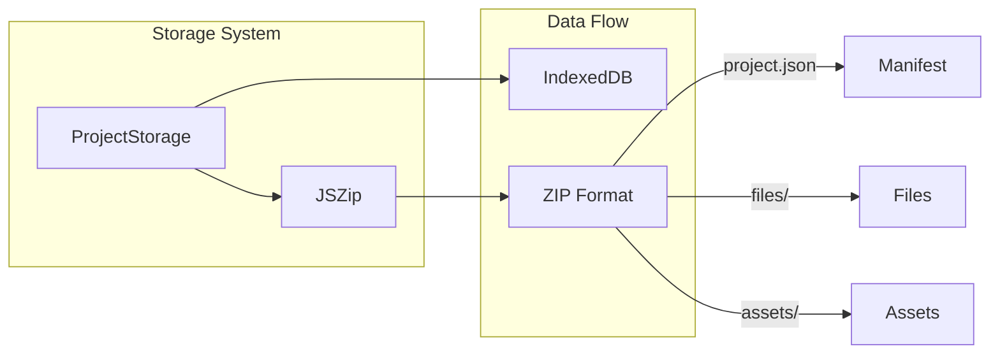

# Storage & Persistence Specification

**Module:** utils/storage, utils/zip
**Files:**
- `src/utils/storage.ts`
- `src/utils/zip.ts`

---

## 1. Overview

The storage system uses **IndexedDB** for project persistence and **JSZip** for project import/export as ZIP files.



### 1.1 ZIP Structure

```mermaid
graph hierarchy
root[(project.zip)]
├── project.json
├── files/
    ├── main.py
    └── ...
└── assets/
    ├── sprite.svg
    └── ...
```

---

## 2. ProjectStorage

### 2.1 Database Schema

```typescript
const DB_NAME = "WebIDE";
const DB_VERSION = 1;
const STORE_NAME = "projects";
```

### 2.2 StoredProject Interface

```typescript
interface StoredProject extends Project {
  id: string;           // "proj_{timestamp}_{random}"
  name: string;
  createdAt: string;    // ISO timestamp
  updatedAt: string;    // ISO timestamp
  isExample: boolean;
  currentFile?: string;
}

interface Project {
  files: Record<string, string>;    // filename → content
  currentFile?: string;
  assets: Record<string, string>;    // name → dataURL
}
```

### 2.3 Indexes

| Index | Purpose |
|-------|---------|
| name | Project listing |
| updatedAt | Sorting by modification time |
| isExample | Filtering user projects |

### 2.4 Methods

| Method | Signature | Description |
|--------|-----------|-------------|
| getAllProjects | `async () => Promise<StoredProject[]>` | Get all projects (sorted by updatedAt desc) |
| getUserProjects | `async () => Promise<StoredProject[]>` | Get non-example projects |
| getProject | `async (id: string) => Promise<StoredProject \| null>` | Get single project |
| saveProject | `async (project) => Promise<StoredProject>` | Create or update |
| createProject | `async (name: string, data: Project) => Promise<StoredProject>` | Create new |
| updateProject | `async (id: string, updates) => Promise<StoredProject>` | Update existing |
| deleteProject | `async (id: string) => Promise<void>` | Delete project |
| forkExample | `async (name: string, project: Project, newName?: string) => Promise<StoredProject>` | Fork example |
| importProjectFromZip | `async (zipData: ArrayBuffer, name?: string) => Promise<StoredProject>` | Import ZIP |
| exportProjectToZip | `async (id: string) => Promise<ArrayBuffer>` | Export to ZIP |
| downloadProjectZip | `async (id: string, filename?: string) => Promise<void>` | Download ZIP |
| clearAllUserProjects | `async () => Promise<void>` | Delete all user projects |
| getProjectCount | `async () => Promise<number>` | Count projects |

### 2.5 ID Generation

```typescript
const id = `proj_${Date.now().toString(36)}_${Math.random().toString(36).slice(2, 8)}`;
// Example: "proj_m1abc123_xyz789"
```

### 2.6 Singleton Pattern

```typescript
export const projectStorage = new ProjectStorage();
```

Usage:
```typescript
import { projectStorage } from "../utils/storage";
const projects = await projectStorage.getUserProjects();
```

---

## 3. ZIP Format

### 3.1 ZIP Structure

```
project.zip/
├── project.json       # Manifest (required)
├── files/             # Source files directory
│   ├── main.py
│   ├── helper.py
│   └── ...
└── assets/            # Asset files directory
    ├── sprite.svg
    ├── background.png
    └── ...
```

### 3.2 Manifest Schema

```typescript
interface ProjectManifest {
  id: string;
  name: string;
  updatedAt: string;
  currentFile?: string;
  files: string[];     // File names in archive
  assets: string[];    // Asset names in archive
}
```

### 3.3 Example Manifest

```json
{
  "id": "proj_m1abc123_xyz789",
  "name": "My Snake Game",
  "updatedAt": "2026-04-30T12:00:00.000Z",
  "currentFile": "snake.py",
  "files": ["snake.py", "snake_cfg.py", "apple_cfg.py"],
  "assets": ["grassCenter.svg", "apple.svg"]
}
```

---

## 4. ZIP Utility Functions

### 4.1 projectToZip

```typescript
export async function projectToZip(project: StoredProject): Promise<Uint8Array> {
  const zip = new JSZip();

  // Add manifest
  const manifest: ProjectManifest = {
    id: project.id,
    name: project.name,
    updatedAt: project.updatedAt,
    currentFile: project.currentFile,
    files: project.files.map(f => f.name),
    assets: Object.keys(project.assets || {}),
  };
  zip.file("project.json", JSON.stringify(manifest, null, 2));

  // Add files
  for (const f of project.files) {
    const path = `files/${f.name}`.replace(/^[\\/]+/, "").replace(/\\/g, "/");
    zip.file(path, textToBytes(f.content ?? ""), { binary: true });
  }

  // Add assets
  for (const [name, blobLike] of Object.entries(project.assets || {})) {
    const path = `assets/${name}`.replace(/^[\\/]+/, "").replace(/\\/g, "/");
    zip.file(path, await assetToBytes(blobLike), { binary: true });
  }

  return await zip.generateAsync({
    type: "uint8array",
    compression: "DEFLATE",
    compressionOptions: { level: 6 },
  });
}
```

### 4.2 zipToProject

```typescript
export async function zipToProject(
  zipInput: ArrayBuffer | Uint8Array,
  defaults?: { id?: string; name?: string }
): Promise<StoredProject> {
  const zip = await JSZip.loadAsync(zipInput instanceof Uint8Array ? zipInput : new Uint8Array(zipInput));

  // Parse manifest
  const manifestFile = zip.file("project.json");
  let manifest: ProjectManifest | null = null;
  if (manifestFile) {
    const text = await manifestFile.async("string");
    manifest = JSON.parse(text);
  }

  // Extract files
  const files: { name: string; content: string }[] = [];
  const fileEntries = Object.values(zip.files).filter(
    e => !e.dir && e.name.startsWith("files/")
  );
  for (const e of fileEntries) {
    const name = e.name.slice("files/".length);
    const content = await e.async("string");
    files.push({ name, content });
  }

  // Extract assets
  const assets: Record<string, Blob> = {};
  const assetEntries = Object.values(zip.files).filter(
    e => !e.dir && e.name.startsWith("assets/")
  );
  for (const e of assetEntries) {
    const name = e.name.slice("assets/".length);
    const buf = await e.async("uint8array");
    const type = guessMimeByExt(name);
    assets[name] = new Blob([toArrayBuffer(buf)], { type });
  }

  return {
    id: manifest?.id ?? defaults?.id ?? generateId(),
    name: manifest?.name ?? defaults?.name ?? "Untitled Project",
    updatedAt: manifest?.updatedAt ?? new Date().toISOString(),
    currentFile: manifest?.currentFile ?? files[0]?.name ?? "",
    files,
    assets,
  };
}
```

### 4.3 downloadProjectZip

```typescript
export async function downloadProjectZip(project: StoredProject, filename?: string) {
  const bytes = await projectToZip(project);
  const blob = new Blob([toArrayBuffer(bytes)], { type: "application/zip" });
  const url = URL.createObjectURL(blob);

  const a = document.createElement("a");
  a.href = url;
  a.download = filename || `${safeFilename(project.name)}.zip`;
  document.body.appendChild(a);
  a.click();
  a.remove();

  URL.revokeObjectURL(url);
}
```

---

## 5. Asset Handling

### 5.1 assetToBytes

```typescript
async function assetToBytes(asset: Blob | Uint8Array | string): Promise<Uint8Array> {
  if (asset instanceof Uint8Array) return asset;
  if (asset instanceof Blob) {
    const ab = await asset.arrayBuffer();
    return new Uint8Array(ab);
  }
  if (asset.startsWith?.("data:")) {
    // Data URL → Blob → Uint8Array
    const blob = dataURLToBlob(asset);
    const ab = await blob.arrayBuffer();
    return new Uint8Array(ab);
  }
  return textToBytes(asset);  // Fallback for plain text
}
```

### 5.2 dataURLToBlob

```typescript
function dataURLToBlob(dataUrl: string): Blob {
  const [meta, content] = dataUrl.split(",", 2);
  const isBase64 = /;base64$/i.test(meta);
  const mime = meta.match(/data:(.*?)(;|$)/)?.[1] || "application/octet-stream";
  const bin = isBase64 ? atob(content) : decodeURIComponent(content);
  const arr = new Uint8Array(bin.length);
  for (let i = 0; i < bin.length; i++) arr[i] = bin.charCodeAt(i);
  return new Blob([arr], { type: mime });
}
```

### 5.3 Mime Type Guessing

```typescript
function guessMimeByExt(name: string): string {
  const ext = name.toLowerCase().split(".").pop() || "";
  switch (ext) {
    case "png": return "image/png";
    case "jpg":
    case "jpeg": return "image/jpeg";
    case "gif": return "image/gif";
    case "webp": return "image/webp";
    case "svg": return "image/svg+xml";
    case "json": return "application/json";
    case "txt":
    case "md": return "text/plain";
    default: return "application/octet-stream";
  }
}
```

---

## 6. Import/Export Flow

### 6.1 Export Project

```
User clicks Export
    ↓
handleExportProject(id)
    ↓
projectStorage.downloadProjectZip(id)
    ↓
getProject(id) → fetch from IndexedDB
    ↓
convert assets (dataURL → Blob)
    ↓
projectToZip(project) → Uint8Array
    ↓
create Blob + download link
    ↓
browser download
```

### 6.2 Import Project

```
User selects ZIP file
    ↓
ImportDialog.onImport(file)
    ↓
importProjectFromFile(file)
    ↓
zipToProject(arrayBuffer) → StoredProject
    ↓
projectStorage.createProject(name, { files, assets })
    ↓
add to userProjects list
    ↓
changeEditorCurrentProject(newProject, newProject.id)
```

---

## 7. Auto-Save

**File:** `src/hooks/useAutoSave.ts`

```typescript
const AUTO_SAVE_INTERVAL = 60000; // 60 seconds

export function useAutoSave() {
  const currentProjectId = useEditor(s => s.currentProjectId);
  const dirtyFiles = useEditor(s => s.dirtyFiles);
  const markClean = useEditor(s => s.markClean);
  const updateLastSaveTime = useEditor(s => s.updateLastSaveTime);
  const saveCurrentProject = useIde(s => s.saveCurrentProject);

  useEffect(() => {
    if (!currentProjectId || dirtyFiles.size === 0) return;

    const interval = setInterval(() => {
      saveCurrentProject();
      markClean();
      updateLastSaveTime();
    }, AUTO_SAVE_INTERVAL);

    return () => clearInterval(interval);
  }, [currentProjectId, dirtyFiles.size, saveCurrentProject, markClean, updateLastSaveTime]);
}
```

**Trigger Conditions:**
- `currentProjectId` must exist (user project, not example)
- `dirtyFiles.size > 0` (unsaved changes)

---

## 8. Data Flow

### 8.1 Save Current Project

```typescript
saveCurrentProject: async () => {
  const { currentProjectId, project } = useEditor.getState();
  if (!currentProjectId) return;

  const { userProjects } = get();
  const existingProject = userProjects.find(p => p.id === currentProjectId);
  if (!existingProject) return;

  // Update in IndexedDB
  await projectStorage.updateProject(currentProjectId, {
    files: project.files,
    assets: project.assets,
    currentFile: useEditor.getState().currentFile,
  });

  // Update in-memory list
  const updatedUserProjects = userProjects.map(p =>
    p.id === currentProjectId
      ? { ...p, files: project.files, assets: project.assets, updatedAt: new Date().toISOString() }
      : p
  );
  set({ userProjects: updatedUserProjects });
}
```

---

## 9. IndexedDB Implementation

### 9.1 Initialization

```typescript
private async init(): Promise<void> {
  this.initPromise = new Promise((resolve, reject) => {
    const request = indexedDB.open(DB_NAME, DB_VERSION);

    request.onerror = () => reject(request.error);
    request.onsuccess = () => {
      this.db = request.result;
      resolve();
    };

    request.onupgradeneeded = (event) => {
      const db = (event.target as IDBOpenDBRequest).result;

      if (!db.objectStoreNames.contains(STORE_NAME)) {
        const store = db.createObjectStore(STORE_NAME, { keyPath: "id" });
        store.createIndex("name", "name", { unique: false });
        store.createIndex("updatedAt", "updatedAt", { unique: false });
        store.createIndex("isExample", "isExample", { unique: false });
      }
    };
  });

  return this.initPromise;
}
```

### 9.2 Transaction Pattern

```typescript
async getProject(id: string): Promise<StoredProject | null> {
  const db = await this.ensureDb();

  return new Promise((resolve, reject) => {
    const transaction = db.transaction(STORE_NAME, "readonly");
    const store = transaction.objectStore(STORE_NAME);
    const request = store.get(id);

    request.onerror = () => reject(request.error);
    request.onsuccess = () => resolve(request.result || null);
  });
}
```

---

## 10. Error Handling

### 10.1 Common Errors

| Error | Handling |
|-------|----------|
| IndexedDB not available | Fallback to in-memory (not implemented - errors logged) |
| Corrupt ZIP | `zipToProject` returns default project |
| Missing manifest | Use defaults (id, name, currentFile) |
| Missing files/assets | Skip missing entries |

### 10.2 Import Validation

```typescript
// Verify it's a valid ZIP
try {
  const zip = await JSZip.loadAsync(zipInput);
  // Check for project.json
  const manifestFile = zip.file("project.json");
  if (!manifestFile) {
    throw new Error("Invalid project: missing project.json");
  }
} catch (e) {
  // Show error to user
  alert(t('sideMenu.failedImport'));
}
```

---

*End of Storage & Persistence Specification*