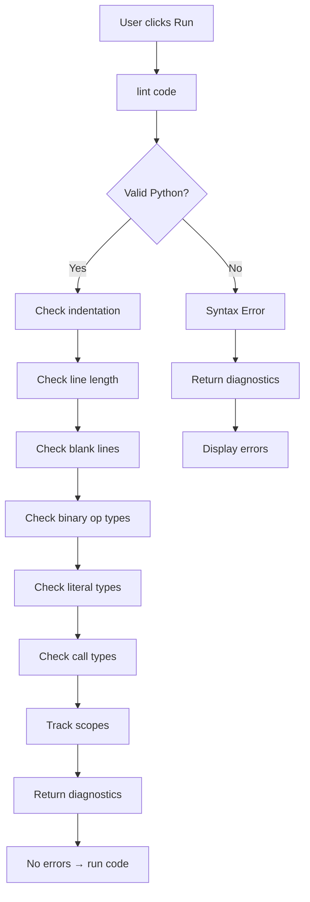

# Linter Specification

**Module:** Python Linter
**File:** `src/assets/python/linter.py`

---

## 1. Overview

The linter is a pure Python module that runs inside Pyodide. It performs static analysis on student Python code and returns a list of diagnostics.

**Design Goals:**
- No external WASM dependencies
- Student-friendly error messages via i18n keys
- Run on "Run" click, not while typing

### 1.1 Lint Flow



---

## 2. Diagnostics

### 2.1 Diagnostic Structure

```python
{
    "code": "E999",              # Error code
    "messageKey": "linter.E999", # i18n key
    "messageArgs": {},           # Arguments for translation
    "row": 0,                    # 0-indexed line
    "column": 0,                 # 0-indexed column
    "endRow": 0,
    "endColumn": 1,
    "severity": "error"
}
```

### 2.2 Error Codes

| Code | Description | Example |
|------|-------------|---------|
| E999 | Generic syntax error | `def foo ` |
| E999Colon | Missing colon | `def foo` |
| E999Unclosed | Unclosed bracket/parens | `print("hello` |
| E999Unterminated | Unterminated string | `"hello` |
| E999Invalid | Invalid syntax | `1 + 2 = 3` |
| E999EOL | Premature end of line | `print("hello\` |
| E999Unmatched | Unmatched brackets | `([)]` |
| E999Assign | Cannot assign to expression | `x + y = 3` |
| E101 | Indentation contains tabs | `\tprint("hi")` |
| E111 | Indentation not multiple of 4 | `print("hi")  # 2 spaces` |
| E225 | Unsupported operand types | `3 + "2"` |
| E225Call | Method argument type mismatch | `arr.append("str")` when arr is `list[int]` |
| E301 | Missing blank lines between top-level definitions | Two functions directly adjacent |
| E303 | Too many blank lines | More than 2 blank lines between defs |
| E501 | Line too long (>100 chars) | Very long line |
| F401 | Imported but unused | `import os; print("hi")` |
| F821 | Undefined name | `print(x)` where x not defined |

---

## 3. Architecture

### 3.1 Main Entry Point

```python
def lint(code: str, filename: str = "main.py") -> list[dict]:
    diagnostics = []

    try:
        tree = ast.parse(code, filename)
    except SyntaxError as e:
        # Handle syntax errors
        return [_make_diagnostic("E999", msg_key, msg_args, e.lineno, e.offset)]

    # Style checks
    diagnostics.extend(_check_indentation(code, tree))
    diagnostics.extend(_check_line_length(code, tree))
    diagnostics.extend(_check_blank_lines(code, tree))

    # Semantic checks
    diagnostics.extend(_check_binary_op_types(code, tree))
    diagnostics.extend(_check_literal_types(code, tree))
    diagnostics.extend(_check_call_types(code, tree))

    # Scope tracking
    scope_tracker = ScopeTracker(tree, code)
    scope_tracker.visit(tree)
    diagnostics.extend(scope_tracker.diagnostics)

    return sorted(diagnostics, key=lambda d: (d["row"], d["column"]))
```

### 3.2 Check Order

1. **Syntax** (via `ast.parse`)
2. **Indentation** (tabs, multiples of 4)
3. **Line length** (>100 chars)
4. **Blank lines** (between top-level defs)
5. **Binary op types** (3 + "2")
6. **Literal types** (`x: Literal["a", "b"] = "c"`)
7. **Call types** (`arr.append("str")`)
8. **Scope** (undefined names, unused imports)

---

## 4. Check Implementations

### 4.1 Syntax Check

```python
try:
    tree = ast.parse(code, filename)
except SyntaxError as e:
    msg = e.msg
    if "expected ':'" in msg:
        msg_key = "linter.E999Colon"
    elif "was never closed" in msg:
        msg_key = "linter.E999Unclosed"
    elif "unterminated string" in msg:
        msg_key = "linter.E999Unterminated"
    elif "invalid syntax" in msg:
        msg_key = "linter.E999Invalid"
    elif "EOL" in msg or "EOF" in msg:
        msg_key = "linter.E999EOL"
    elif "unmatched" in msg:
        msg_key = "linter.E999Unmatched"
    elif "can't assign to" in msg:
        msg_key = "linter.E999Assign"
    else:
        msg_key = "linter.E999"
```

### 4.2 Indentation Check

```python
def _check_indentation(code: str, tree: ast.Module) -> list[dict]:
    for node in ast.walk(tree):
        if isinstance(node, (ast.FunctionDef, ast.AsyncFunctionDef, ast.ClassDef)):
            if node.body:
                first_stmt = node.body[0]
                line = code.splitlines()[first_stmt.lineno - 1]
                stripped = line.lstrip()

                # Check for tabs
                if stripped and "\t" in line[:len(line)-len(stripped)]:
                    diagnostics.append(_make_diagnostic("E101", ...))

                # Check for non-multiple of 4
                indent = len(line) - len(stripped)
                if indent > 0 and indent % 4 != 0:
                    diagnostics.append(_make_diagnostic("E111", "linter.E111", {"found": indent}, ...))
```

### 4.3 Blank Lines Check

```python
def _check_blank_lines(code: str, tree: ast.Module) -> list[dict]:
    # Collect function/class definitions
    top_level_defs = []
    for node in ast.walk(tree):
        if isinstance(node, (ast.FunctionDef, ast.AsyncFunctionDef, ast.ClassDef)):
            # Get start (consider decorators) and end line
            start_lineno = node.lineno
            if node.decorator_list:
                start_lineno = node.decorator_list[0].lineno
            end_lineno = node.end_lineno if hasattr(node, "end_lineno") else node.lineno
            top_level_defs.append((start_lineno, end_lineno))

    # Check blank lines between consecutive defs
    for i in range(len(top_level_defs) - 1):
        current_end, next_start = top_level_defs[i][1], top_level_defs[i+1][0]
        blank_count = sum(1 for l in range(current_end, next_start) if code.splitlines()[l] == "")

        if blank_count > 2:
            diagnostics.append(_make_diagnostic("E303", "linter.E303", {"count": blank_count}, ...))
        elif blank_count < 2 and next_start - current_end > 1:
            diagnostics.append(_make_diagnostic("E301", "linter.E301", {}, ...))
```

### 4.4 Binary Op Type Check

```python
class TypeChecker(ast.NodeVisitor):
    def visit_BinOp(self, node):
        op_name = type(node.op).__name__
        left_type = self._get_type(node.left)
        right_type = self._get_type(node.right)

        if op_name == "Add":
            # num + num = num, str + str = str
            # num + str = ERROR
            if (left_type in NUM_LIKE and right_type in STR_LIKE) or \
               (right_type in NUM_LIKE and left_type in STR_LIKE):
                diagnostics.append(_make_diagnostic("E225", ...))

        elif op_name == "Mult":
            # num * num = num
            # str * int = str (repetition)
            # anything else = ERROR
            if not (left_type in NUM_LIKE and right_type in NUM_LIKE):
                if not (left_type in STR_LIKE and right_type in INT_LIKE) and \
                   not (right_type in STR_LIKE and left_type in INT_LIKE):
                    diagnostics.append(_make_diagnostic("E225", ...))
```

### 4.5 Scope Tracking (F401, F821)

```python
class ScopeTracker(ast.NodeVisitor):
    def __init__(self, tree, code):
        self.scopes = [set()]      # Variable scopes
        self.imports = [set()]      # Imported names
        self.defined_in_scope = [set()]
        self.used_names = set()
        self.diagnostics = []

    def visit_Name(self, node):
        if isinstance(node.ctx, ast.Load):
            # Check if name is in any scope
            if node.id not in self.scopes[-1]:
                # Check builtins
                if node.id not in {"print", "len", "range", ...}:
                    diagnostics.append(_make_diagnostic("F821", "linter.F821", {"name": node.id}, ...))

    def visit_Import(self, node):
        for alias in node.names:
            name = alias.asname if alias.asname else alias.name.split(".")[0]
            self.imports[-1].add(name)
            self.scopes[-1].add(name)

    def visit_ImportFrom(self, node):
        for alias in node.names:
            name = alias.asname if alias.asname else alias.name
            self.imports[-1].add(name)
            self.scopes[-1].add(name)
```

---

## 5. Type Inference

### 5.1 Type Categories

```python
INT_LIKE = {"int"}
NUM_LIKE = {"int", "float"}
STR_LIKE = {"str"}
```

### 5.2 Type Getting

```python
def _get_type(self, node: ast.AST) -> str | None:
    if isinstance(node, ast.Constant):
        if isinstance(node.value, bool): return "bool"
        elif isinstance(node.value, int): return "int"
        elif isinstance(node.value, float): return "float"
        elif isinstance(node.value, str): return "str"
    elif isinstance(node, ast.Name):
        return var_types.get(node.id)  # Track variable types
    elif isinstance(node, ast.Call):
        # Built-in functions
        if func_name in {"str", "int", "float", "list", ...}:
            return func_name
    # ...
```

---

## 6. Known Modules

The linter knows about certain modules to allow star imports:

```python
self.known_star_modules = {
    "graphics",
    "graphics.actors",
    "graphics.actors.config",
}
```

This prevents F821 errors when using:
```python
from graphics import *
```

---

## 7. Translation Keys

### 7.1 Message Keys

| Key | Description |
|-----|-------------|
| linter.E999 | Syntax error |
| linter.E999Colon | Syntax error: expected ':' |
| linter.E999Unclosed | Syntax error: unclosed bracket or parenthesis |
| linter.E999Unterminated | Syntax error: unterminated string |
| linter.E999Invalid | Syntax error: invalid syntax |
| linter.E999EOL | Syntax error: premature end of line |
| linter.E999Unmatched | Syntax error: unmatched brackets or parentheses |
| linter.E999Assign | Syntax error: cannot assign to this expression |
| linter.E101 | Indentation contains tabs |
| linter.E111 | Indentation not multiple of 4 (found {{found}}) |
| linter.E225 | Unsupported operand types for {{op}}: '{{left}}' and '{{right}}' |
| linter.E225Call | {{method}}() argument must be {{expected}}, not {{found}} |
| linter.E301 | Expected 2 blank lines between top-level definitions |
| linter.E303 | Too many blank lines ({{count}}) |
| linter.E501 | Line too long ({{length}} > {{limit}}) |
| linter.F401 | '{{name}}' imported but unused |
| linter.F821 | Undefined name '{{name}}' |

---

## 8. Example Diagnostics

### 8.1 Syntax Error
```python
def foo
```
```json
{
  "code": "E999",
  "messageKey": "linter.E999Colon",
  "messageArgs": {},
  "row": 0,
  "column": 7,
  "endRow": 0,
  "endColumn": 8,
  "severity": "error"
}
```

### 8.2 Type Mismatch
```python
x = 3 + "2"
```
```json
{
  "code": "E225",
  "messageKey": "linter.E225",
  "messageArgs": {"op": "+", "left": "int", "right": "str"},
  "row": 0,
  "column": 4,
  "endRow": 0,
  "endColumn": 13,
  "severity": "error"
}
```

### 8.3 Undefined Name
```python
print(x)
```
```json
{
  "code": "F821",
  "messageKey": "linter.F821",
  "messageArgs": {"name": "x"},
  "row": 0,
  "column": 6,
  "endRow": 0,
  "endColumn": 7,
  "severity": "error"
}
```

---

## 9. Limitations

1. **No control flow analysis** - Undefined names in if/else branches may not be caught
2. **Limited type inference** - Only basic types are inferred
3. **No imports analysis** - Can't verify if imported names actually exist
4. **No function definition tracking** - Calls to undefined functions not caught

---

*End of Linter Specification*