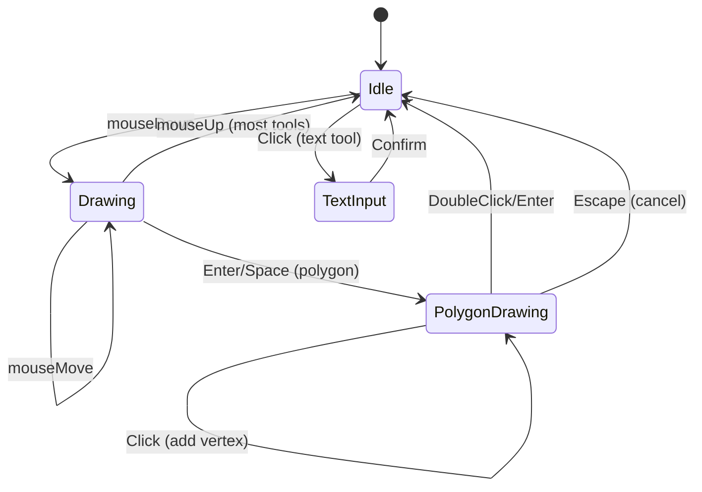

# Sprite Editor Specification

**Module:** SpriteEditor
**File:** `src/SpriteEditor.tsx`

---

## 1. Overview

The Sprite Editor is a Konva-based vector graphics editor for creating sprite assets. It produces SVG output that can be used as game sprites.

**Features:**
- Multiple shape tools (rectangle, ellipse, line, freehand, polygon, text)
- Color picker with palette and custom color
- Stroke width control
- Undo/Redo
- SVG import/export

### 1.1 Tool State Machine



---

## 2. Canvas Configuration

### 2.1 Canvas Sizes

```typescript
type SpriteEditorProps = {
  size?: 64 | 128;  // Sprite size in pixels
};
```

| Size | Scale | Canvas Dimensions |
|------|-------|-------------------|
| 64 | 5x | 320x320 |
| 128 | 3x | 384x384 |

### 2.2 Canvas Setup

```typescript
const SCALE = size === 64 ? 5 : 3;
const W = size * SCALE;  // Canvas pixel width
const H = size * SCALE;  // Canvas pixel height
```

---

## 3. Tools

### 3.1 Tool Types

```typescript
type Tool = "select" | "rect" | "ellipse" | "line" | "freehand" | "polygon" | "text";
```

### 3.2 Tool Behaviors

| Tool | Icon | Create | Modify | Complete |
|------|------|--------|--------|----------|
| select | MdNorthWest | Click shape | Drag/move | Click empty |
| rect | MdCropSquare | Click+drag | Resize handles | Release |
| ellipse | MdCircle | Click+drag | Resize handles | Release |
| line | MdLineAxis | Click start | - | Double-click end |
| freehand | MdEdit | Click+drag | - | Release |
| polygon | MdPolyline | Click vertices | - | Enter/double-click |
| text | MdTextFields | Click position | - | Prompt |

### 3.3 Select Tool

- Click on shape to select
- Drag shape to move
- Shows Transformer for resize
- Click empty area to deselect

### 3.4 Shape Tools (Rect, Ellipse)

```typescript
onMouseDown: (e) => {
  const { x, y } = getPos(e);
  const base = { id: uid(), fill, stroke, strokeWidth };

  if (tool === "rect") {
    setDraft({ ...base, kind: "rect", x, y, width: 0, height: 0 });
  } else if (tool === "ellipse") {
    setDraft({ ...base, kind: "ellipse", x, y, radiusX: 0, radiusY: 0 });
  }
  setIsDrawing(true);
}

onMouseMove: (e) => {
  if (!isDrawing || !draft) return;

  if (draft.kind === "rect") {
    const d = draft as RectData;
    setDraft({ ...d, width: Math.abs(x - d.x), height: Math.abs(y - d.y) });
  } else if (draft.kind === "ellipse") {
    const d = draft as EllipseData;
    setDraft({ ...d, radiusX: Math.abs(x - d.x), radiusY: Math.abs(y - d.y) });
  }
}

onMouseUp: () => {
  commit([...shapes, draft]);
  setDraft(null);
  setIsDrawing(false);
}
```

### 3.5 Line Tool

- Click for start point
- Move mouse (preview line)
- Double-click for end point
- Enter also completes

### 3.6 Freehand Tool

- Click+drag to draw path
- Release to finish
- Auto-close if end point within 15px of start
- Fill if closed and fill color is not transparent

### 3.7 Polygon Tool

- Click to add vertices
- Each click adds a point
- Preview line to mouse cursor
- Enter, Space, or double-click to close
- Escape to cancel

### 3.8 Text Tool

- Click on canvas
- Shows prompt for text input
- Creates text shape at click position

---

## 4. Shape Data

### 4.1 ShapeBase

```typescript
type ShapeBase = {
  id: string;
  fill: string;
  stroke: string;
  strokeWidth: number;
};
```

### 4.2 Shape Types

```typescript
type RectData = ShapeBase & {
  kind: "rect";
  x: number;
  y: number;
  width: number;
  height: number;
};

type EllipseData = ShapeBase & {
  kind: "ellipse";
  x: number;
  y: number;
  radiusX: number;
  radiusY: number;
};

type LineData = ShapeBase & { kind: "line"; points: number[] };

type FreehandData = ShapeBase & {
  kind: "freehand";
  points: number[];
  closed: boolean;
};

type PolygonData = ShapeBase & {
  kind: "polygon";
  points: number[];
  closed: boolean;
};

type TextData = ShapeBase & {
  kind: "text";
  x: number;
  y: number;
  text: string;
  fontSize: number;
};
```

### 4.3 Point Storage

Points are stored as flat arrays: `[x1, y1, x2, y2, ...]`

---

## 5. State Management

### 5.1 State Variables

```typescript
const [shapes, setShapes] = useState<ShapeData[]>([]);           // All shapes
const [history, setHistory] = useState<ShapeData[][]>([]);        // Undo stack
const [future, setFuture] = useState<ShapeData[][]>([]);           // Redo stack
const [selectedId, setSelectedId] = useState<string | null>(null);
const [tool, setTool] = useState<Tool>("rect");
const [fill, setFill] = useState("#4ade80");
const [stroke, setStroke] = useState("#1e293b");
const [strokeWidth, setStrokeWidth] = useState(1);
const [draft, setDraft] = useState<ShapeData | null>(null);       // In-progress shape
const [isDrawing, setIsDrawing] = useState(false);
```

### 5.2 Undo/Redo

```typescript
const commit = (next: ShapeData[]) => {
  setHistory([...history, shapes]);  // Save current for undo
  setFuture([]);                     // Clear redo
  setShapes(next);
};

const undo = () => {
  if (!history.length) return;
  setFuture([shapes, ...future]);
  setShapes(history[history.length - 1]);
  setHistory(h => h.slice(0, -1));
  setSelectedId(null);
};

const redo = () => {
  if (!future.length) return;
  setHistory([...history, shapes]);
  setShapes(future[0]);
  setFuture(f => f.slice(1));
  setSelectedId(null);
};
```

### 5.3 Delete

```typescript
const deleteSelected = () => {
  if (!selectedId) return;
  commit(shapes.filter(s => s.id !== selectedId));
  setSelectedId(null);
};
```

---

## 6. Color System

### 6.1 Color Palette

```typescript
const COLOR_PALETTE = [
  "#000000", "#ffffff", "#ff0000", "#00ff00",
  "#0000ff", "#ffff00", "#ff00ff", "#00ffff",
  "#ff8800", "#88ff00", "#0088ff", "#ff0088",
  "#884400", "#448800", "#004488", "#880044",
];
```

### 6.2 Custom Color

HTML color input for custom colors:
```tsx
<input type="color" value={fill} onChange={(e) => handleFillChange(e.target.value)} />
```

### 6.3 Transparency

Transparent fill is represented by:
- `"transparent"`
- `"#00000000"`
- `rgba(0,0,0,0)`
- `rgba(255,255,255,0)`

---

## 7. Rendering

### 7.1 Konva Elements

| Shape | Konva Component | Props |
|-------|-----------------|-------|
| Rect | KRect | x, y, width, height, fill, stroke, strokeWidth |
| Ellipse | KEllipse | x, y, radiusX, radiusY, fill, stroke, strokeWidth |
| Line | KLine | points, fill (when closed), stroke, strokeWidth |
| Freehand | KLine | points, tension: 0.4, closed, fill, stroke |
| Polygon | KLine | points, closed, fill, stroke |
| Text | KText | x, y, text, fontSize, fill |

### 7.2 Selection

Selected shapes show:
- Cyan stroke color (`#22d3ee`)
- Transformer handles for resize

```typescript
const renderShape = (s: ShapeData, isDraft = false): React.ReactNode => {
  const isSelected = s.id === selectedId;
  const draggable = tool === "select" && !isDraft;

  const common = {
    id: isDraft ? undefined : s.id,
    stroke: isSelected ? "#22d3ee" : s.stroke,
    strokeWidth: s.strokeWidth * SCALE,
    draggable,
    onClick: tool === "select" && !isDraft ? () => setSelectedId(s.id) : undefined,
  };

  if (s.kind === "rect") {
    return <KRect {...common} fill={s.fill} x={r.x * SCALE} ... />;
  }
  // ...
};
```

### 7.3 Transformer

```tsx
<Transformer
  ref={trRef}
  rotateEnabled={false}
  boundBoxFunc={(_old, nw) => nw}
/>
```

### 7.4 Center Crosshair

Visual indicator for sprite center:
```tsx
<KLine points={[W/2 - 8, H/2, W/2 + 8, H/2]} stroke="#22d3ee" strokeWidth={1} />
<KLine points={[W/2, H/2 - 8, W/2, H/2 + 8]} stroke="#22d3ee" strokeWidth={1} />
<KCircle x={W/2} y={H/2} radius={3} stroke="#22d3ee" strokeWidth={1} />
```

---

## 8. SVG Export

### 8.1 Export Format

```typescript
const saveSVG = () => {
  const els = shapes.map(s => {
    if (s.kind === "rect") {
      return `<rect x="${r.x}" y="${r.y}" width="${r.width}" height="${r.height}" fill="${f}" stroke="${st}" stroke-width="${sw}"/>`;
    }
    // ... other shapes
  }).join("\n  ");

  const svg = `<svg xmlns="http://www.w3.org/2000/svg" width="${size}" height="${size}" viewBox="0 0 ${size} ${size}">\n  ${els}\n</svg>`;
  onSave(spriteName, `data:image/svg+xml;base64,${btoa(svg)}`);
};
```

### 8.2 SVG Output Examples

**Rectangle:**
```svg
<rect x="10" y="10" width="30" height="20" fill="#4ade80" stroke="#1e293b" stroke-width="1"/>
```

**Ellipse:**
```svg
<ellipse cx="32" cy="32" rx="20" ry="15" fill="#4ade80" stroke="#1e293b" stroke-width="1"/>
```

**Line:**
```svg
<path d="M 10 10 L 50 50" fill="none" stroke="#1e293b" stroke-width="1" stroke-linecap="round"/>
```

**Polygon:**
```svg
<polygon points="10,10 50,10 50,50 10,50" fill="#4ade80" stroke="#1e293b" stroke-width="1"/>
```

---

## 9. SVG Import

### 9.1 Parsing Elements

**rect:**
```typescript
svg.querySelectorAll('rect').forEach((rect) => {
  const x = parseFloat(rect.getAttribute('x') || '0');
  const y = parseFloat(rect.getAttribute('y') || '0');
  const width = parseFloat(rect.getAttribute('width') || '0');
  const height = parseFloat(rect.getAttribute('height') || '0');
  // ...
  parsedShapes.push({ kind: 'rect', x, y, width, height, ... });
});
```

**ellipse:**
```typescript
svg.querySelectorAll('ellipse').forEach((ellipse) => {
  const cx = parseFloat(ellipse.getAttribute('cx') || '0');
  const cy = parseFloat(ellipse.getAttribute('cy') || '0');
  const rx = parseFloat(ellipse.getAttribute('rx') || '0');
  const ry = parseFloat(ellipse.getAttribute('ry') || '0');
  // ...
  parsedShapes.push({ kind: 'ellipse', x: cx, y: cy, radiusX: rx, radiusY: ry, ... });
});
```

**polygon:**
```typescript
svg.querySelectorAll('polygon').forEach((polygon) => {
  const pointsAttr = polygon.getAttribute('points') || '';
  const points: number[] = [];
  pointsAttr.trim().split(/[\s,]+/).forEach(n => {
    const val = parseFloat(n);
    if (!isNaN(val)) points.push(val);
  });
  // ...
  parsedShapes.push({ kind: 'polygon', points, closed: true, ... });
});
```

**path (line/freehand):**
```typescript
svg.querySelectorAll('path').forEach((path) => {
  const d = path.getAttribute('d') || '';
  const points: number[] = [];
  const commands = d.match(/[ML][^ML]*/g) || [];
  commands.forEach(cmd => {
    const nums = cmd.slice(1).trim().split(/[\s,]+/).map(parseFloat);
    if (nums.length >= 2) points.push(nums[0], nums[1]);
  });
  // ...
  const isClosed = fill !== 'none';
  parsedShapes.push({ kind: isClosed ? 'freehand' : 'line', points, closed: isClosed, ... });
});
```

### 9.2 Data URL Parsing

```typescript
const svgContent = atob(dataUrl.split(',')[1]);
const parser = new DOMParser();
const doc = parser.parseFromString(svgContent, 'image/svg+xml');
const svg = doc.querySelector('svg');
```

---

## 10. Keyboard Shortcuts

| Key | Action |
|-----|--------|
| Enter | Close polygon |
| Space | Close polygon |
| Escape | Cancel polygon |
| Delete | Delete selected |
| Ctrl+Z | Undo |
| Ctrl+Shift+Z | Redo |

---

## 11. Props

```typescript
type SpriteEditorProps = {
  open: boolean;
  onClose: () => void;
  onSave: (name: string, dataUrl: string) => void;
  size?: 64 | 128;
  initialName?: string;
  initialDataUrl?: string;
};
```

---

## 12. Output

When saved, calls:
```typescript
onSave(spriteName, `data:image/svg+xml;base64,${btoa(svg)}`);
```

The data URL can be loaded as an asset in the project.

---

*End of Sprite Editor Specification*