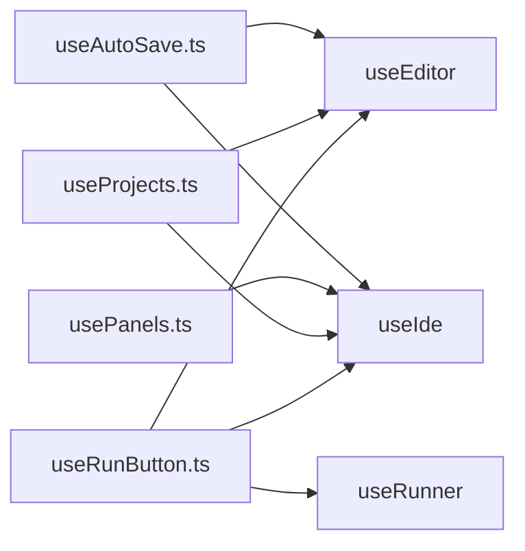

# Hooks Specification

**Module:** hooks
**Files:**
- `src/hooks/useAutoSave.ts`
- `src/hooks/usePanels.ts`
- `src/hooks/useProjects.ts`
- `src/hooks/useRunButton.ts`

---

## 1. Overview

Hooks provide reusable stateful logic for the React components. They encapsulate business logic and connect Zustand stores to UI components.



---

## 2. useAutoSave

**File:** `src/hooks/useAutoSave.ts`

### 2.1 Purpose

Automatically saves the current project every 60 seconds when there are unsaved changes.

### 2.2 Configuration

```typescript
const AUTO_SAVE_INTERVAL = 60000; // 60 seconds
```

### 2.3 Implementation

```typescript
export function useAutoSave() {
  const currentProjectId = useEditor(s => s.currentProjectId);
  const dirtyFiles = useEditor(s => s.dirtyFiles);
  const markClean = useEditor(s => s.markClean);
  const updateLastSaveTime = useEditor(s => s.updateLastSaveTime);
  const saveCurrentProject = useIde(s => s.saveCurrentProject);

  useEffect(() => {
    if (!currentProjectId || dirtyFiles.size === 0) return;

    const interval = setInterval(() => {
      saveCurrentProject();
      markClean();
      updateLastSaveTime();
    }, AUTO_SAVE_INTERVAL);

    return () => clearInterval(interval);
  }, [currentProjectId, dirtyFiles.size, saveCurrentProject, markClean, updateLastSaveTime]);
}
```

### 2.4 Trigger Conditions

- `currentProjectId` must exist (user project, not example)
- `dirtyFiles.size > 0` (unsaved changes)

### 2.5 Actions on Save

1. `saveCurrentProject()` - Persist to IndexedDB
2. `markClean()` - Clear dirtyFiles set
3. `updateLastSaveTime()` - Update timestamp

---

## 3. usePanels

**File:** `src/hooks/usePanels.ts`

### 3.1 Purpose

Manages the open/close state of side panels (Projects, Assets, Settings).

### 3.2 Interface

```typescript
interface UsePanelsReturn {
  activePanel: PanelId;
  isOpen: (id: Exclude<PanelId, null>) => boolean;
  togglePanel: (panel: Exclude<PanelId, null>) => void;
  closePanels: () => void;
}
```

### 3.3 Implementation

```typescript
export function usePanels() {
  const activePanel = useIde(s => s.activePanel);
  const setActivePanel = useIde(s => s.setActivePanel);
  const togglePanel = useIde(s => s.togglePanel);

  const isOpen = (id: Exclude<PanelId, null>) => activePanel === id;
  const closePanels = () => setActivePanel(null);

  return {
    activePanel,
    isOpen,
    togglePanel,
    closePanels,
  };
}
```

### 3.4 PanelId Type

```typescript
type PanelId = "projects" | "assets" | "settings" | null;
```

### 3.5 Behavior

- `togglePanel("projects")` - Opens projects if closed, closes if open
- `isOpen("assets")` - Returns true if assets panel is currently open
- `closePanels()` - Closes any open panel

---

## 4. useProjects

**File:** `src/hooks/useProjects.ts`

### 4.1 Purpose

Provides handlers for project-related operations: opening, creating, deleting, importing, exporting.

### 4.2 Interface

```typescript
interface UseProjectsReturn {
  projects: Record<string, Project>;
  userProjects: UserProject[];
  loading: boolean;
  loadUserProjects: () => Promise<void>;
  handleOpenExample: (name: string) => void;
  handleForkExample: (exampleName: string) => void;
  handleNewProject: (name: string) => void;
  handleDeleteProject: (projectId: string) => void;
  downloadProject: (id: string) => Promise<void>;
  importProjectFromFile: (file: File) => Promise<UserProject>;
}
```

### 4.3 Implementation

```typescript
export function useProjects() {
  const projects = useIde(s => s.projects);
  const userProjects = useIde(s => s.userProjects);
  const loading = useIde(s => s.loading);
  const loadUserProjects = useIde(s => s.loadUserProjects);
  const createNewProject = useIde(s => s.createNewProject);
  const deleteUserProject = useIde(s => s.deleteUserProject);
  const forkExample = useIde(s => s.forkExample);
  const downloadProject = useIde(s => s.downloadProject);
  const importProjectFromFile = useIde(s => s.importProjectFromFile);
  const changeEditorCurrentProject = useEditor(s => s.changeCurrentProject);
  const currentProjectId = useEditor(s => s.currentProjectId);

  const handleOpenExample = useCallback(async (name: string) => {
    const exampleProject = projects[name];
    if (currentProjectId) {
      changeEditorCurrentProject(exampleProject);
    } else {
      changeEditorCurrentProject(exampleProject, undefined);
    }
  }, [projects, currentProjectId, changeEditorCurrentProject]);

  const handleForkExample = useCallback(async (exampleName: string) => {
    const exampleProject = projects[exampleName];
    const forkedProject = await forkExample(exampleName, exampleProject);
    changeEditorCurrentProject(forkedProject, forkedProject.id);
  }, [projects, forkExample, changeEditorCurrentProject]);

  const handleNewProject = useCallback(async (name: string) => {
    const newProject = await createNewProject(name);
    changeEditorCurrentProject(newProject, newProject.id);
  }, [createNewProject, changeEditorCurrentProject]);

  const handleDeleteProject = useCallback(async (projectId: string) => {
    await deleteUserProject(projectId);
    // Switch to first user project or first example
    const firstUserProject = userProjects[0];
    if (firstUserProject) {
      changeEditorCurrentProject(firstUserProject, firstUserProject.id);
    } else {
      const firstExample = Object.keys(projects)[0];
      if (firstExample) {
        changeEditorCurrentProject(projects[firstExample]);
      }
    }
  }, [deleteUserProject, userProjects, projects, changeEditorCurrentProject]);

  return {
    projects,
    userProjects,
    loading,
    loadUserProjects,
    handleOpenExample,
    handleForkExample,
    handleNewProject,
    handleDeleteProject,
    downloadProject,
    importProjectFromFile,
  };
}
```

### 4.4 Delete Handler Logic

When deleting the current project:
1. Delete from IndexedDB
2. Switch to first remaining user project
3. If no user projects, switch to first example

---

## 5. useRunButton

**File:** `src/hooks/useRunButton.ts`

### 5.1 Purpose

Handles the Run/Stop button logic including linting before execution.

### 5.2 Interface

```typescript
interface UseRunButtonOptions {
  onBeforeRun?: () => void;
}

interface UseRunButtonReturn {
  running: boolean;
  isP5: boolean;
  handleRunToggle: () => Promise<void>;
}
```

### 5.3 Implementation

```typescript
export function useRunButton(options: UseRunButtonOptions = {}) {
  const project = useEditor(s => s.project);
  const currentFile = useEditor(s => s.currentFile);
  const dirtyFiles = useEditor(s => s.dirtyFiles);
  const markClean = useEditor(s => s.markClean);
  const saveCurrentProject = useIde(s => s.saveCurrentProject);
  const { running, isP5, run, interrupt, lint, clear, _appendOutput } = useRunner();

  const isStartingRef = useRef(false);

  const handleRunToggle = useCallback(async () => {
    // Stop if running
    if (running || isP5) {
      await interrupt();
      return;
    }

    // Prevent double-start
    if (isStartingRef.current) return;
    isStartingRef.current = true;

    try {
      const code = project.files[currentFile] ?? "";
      const filename = currentFile || "main.py";

      // Save if dirty
      if (dirtyFiles.size > 0) {
        saveCurrentProject();
        markClean();
      }

      clear();
      _appendOutput("stdout", t('console.checking'));
      const diagnostics = await lint(code, filename);

      if (diagnostics.length > 0) {
        _appendOutput("stderr", t('console.syntaxError', { count: diagnostics.length }));
        return;
      }

      _appendOutput("stdout", t('console.noErrors'));
      options.onBeforeRun?.();
      run(project.files, project.assets, currentFile);
    } finally {
      isStartingRef.current = false;
    }
  }, [running, isP5, project, currentFile, dirtyFiles, lint, clear, _appendOutput, run, interrupt, saveCurrentProject, markClean, options, t]);

  return { running, isP5, handleRunToggle };
}
```

### 5.4 Run Flow

```
User clicks Run
    ↓
If running → interrupt() → return
    ↓
If not running
    ↓
Save project if dirty
    ↓
clear() - Clear previous output
    ↓
lint(code, filename) - Check for errors
    ↓
If errors → display errors, stop
    ↓
If no errors → display "No errors found"
    ↓
run(project.files, project.assets, currentFile)
```

### 5.5 Lint Integration

The hook calls `lint()` which returns a Promise resolving to `LintDiagnostic[]`.

```typescript
const lint = useCallback((code: string, filename: string) => {
  return new Promise<LintDiagnostic[]>((resolve) => {
    const handler = (e: MessageEvent<WorkerEvent>) => {
      if (e.data.type === "lint") {
        getWorker().removeEventListener("message", handler);
        const diagnostics = e.data.diagnostics;
        useRunnerStore.getState().setLintErrors(diagnostics);
        resolve(diagnostics);
      }
    };
    getWorker().addEventListener("message", handler);
    getWorker().postMessage({ cmd: "lint", code, filename });
  });
}, []);
```

### 5.6 isStartingRef

Prevents race conditions when clicking Run multiple times rapidly:
```typescript
const isStartingRef = useRef(false);

// In handleRunToggle:
if (isStartingRef.current) return;
isStartingRef.current = true;
// ... run logic
isStartingRef.current = false; // in finally
```

---

## 6. Hook Usage Map

| Component | useAutoSave | usePanels | useProjects | useRunButton |
|-----------|-------------|-----------|-------------|--------------|
| App | ✓ | | | |
| SideMenu | | ✓ | ✓ | ✓ |

---

*End of Hooks Specification*