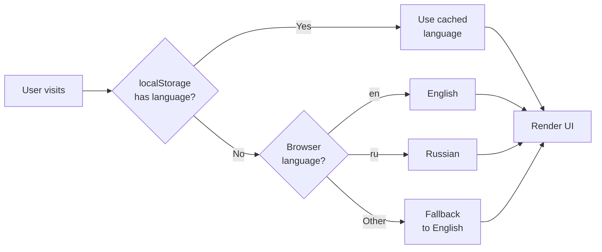

# Internationalization (i18n) Specification

**Module:** i18n
**Files:**
- `src/i18n/index.ts`
- `src/i18n/en.json`
- `src/i18n/ru.json`

---

## 1. Overview

The app uses **i18next** with **react-i18next** for internationalization. Currently supports English and Russian.

---

## 2. Configuration

**File:** `src/i18n/index.ts`

```typescript
import i18n from 'i18next';
import { initReactI18next } from 'react-i18next';
import LanguageDetector from 'i18next-browser-languagedetector';

import en from './en.json';
import ru from './ru.json';

export const SUPPORTED_LANGUAGES = ['en', 'ru'] as const;
export type SupportedLanguage = typeof SUPPORTED_LANGUAGES[number];

i18n
  .use(LanguageDetector)
  .use(initReactI18next)
  .init({
    resources: {
      en: { translation: en },
      ru: { translation: ru },
    },
    fallbackLng: 'en',
    supportedLngs: SUPPORTED_LANGUAGES,
    interpolation: {
      escapeValue: false,
    },
    detection: {
      order: ['localStorage', 'navigator'],
      caches: ['localStorage'],
    },
  });

export default i18n;
```

### 2.1 Configuration Options

| Option | Value | Description |
|--------|-------|-------------|
| fallbackLng | 'en' | Default language |
| supportedLngs | ['en', 'ru'] | Supported languages |
| interpolation.escapeValue | false | Allow HTML in translations |
| detection.order | ['localStorage', 'navigator'] | Language detection order |
| detection.caches | ['localStorage'] | Cache language preference |

---

## 3. Translation Keys

### 3.1 App Namespace

**Key:** `app`

| Key | English | Russian |
|-----|---------|---------|
| app.loading | Loading Python runtime... | Загрузка среды выполнения Python... |
| app.loadingHint | This may take a few seconds... | При первом запуске это может занять... |
| app.copyConsole | Copy console | Копировать консоль |
| app.clearConsole | Clear console | Очистить консоль |
| app.inputPlaceholder | Type input here... | Введите данные здесь... |

### 3.2 SideMenu Namespace

**Key:** `sideMenu`

| Key | English | Russian |
|-----|---------|---------|
| sideMenu.close | Close | Закрыть |
| sideMenu.run | Run | Запустить |
| sideMenu.stop | Stop | Остановить |
| sideMenu.loading | Loading... | Загрузка... |
| sideMenu.projects | Projects | Проекты |
| sideMenu.assets | Assets | Ресурсы |
| sideMenu.settings | Settings | Настройки |
| sideMenu.examples | Examples | Примеры |
| sideMenu.yourProjects | Your Projects | Ваши проекты |
| sideMenu.newProjectTooltip | New project | Новый проект |
| sideMenu.newProject | + New | + Новый |
| sideMenu.noProjects | No projects yet... | Проектов пока нет... |
| sideMenu.importProjectTooltip | Import project | Импорт проекта |
| sideMenu.exportProjectTooltip | Export project | Экспорт проекта |
| sideMenu.deleteProjectTooltip | Delete project | Удалить проект |
| sideMenu.cancel | Cancel | Отмена |
| sideMenu.create | Create | Создать |
| sideMenu.createProject | Create New Project | Создать новый проект |
| sideMenu.projectName | Project Name | Название проекта |
| sideMenu.projectNamePlaceholder | Enter project name | Введите название проекта |
| sideMenu.importProjectTitle | Import Project | Импорт проекта |
| sideMenu.importProjectInstructions | Select a project file (.zip)... | Выберите файл проекта (.zip)... |
| sideMenu.autoSave | Auto-save | Автосохранение |
| sideMenu.vimMode | Vim mode | Режим Vim |
| sideMenu.showHitboxes | Show hitboxes | Показать хитбоксы |
| sideMenu.selectedAssets | Selected Assets | Выбранные ресурсы |
| sideMenu.availableAssets | Available Assets | Доступные ресурсы |
| sideMenu.noAssetsSelected | No assets selected... | Ресурсы не выбраны... |
| sideMenu.remove | Remove | Удалить |
| sideMenu.editSpriteTooltip | Edit sprite | Редактировать спрайт |
| sideMenu.newSprite | New sprite | Новый спрайт |
| sideMenu.spriteNamePlaceholder | sprite name | название спрайта |
| sideMenu.example | (example) | (пример) |
| sideMenu.loadingProjects | Loading projects... | Загрузка проектов... |
| sideMenu.failedExport | Failed to export project... | Не удалось экспортировать... |
| sideMenu.failedImport | Failed to import project... | Не удалось импортировать... |

### 3.3 FileBar Namespace

**Key:** `fileBar`

| Key | English | Russian |
|-----|---------|---------|
| fileBar.deleteConfirm | Are you sure you want to delete "{{filename}}"?" | Вы уверены, что хотите удалить "{{filename}}"?" |
| fileBar.renameFile | Rename file | Переименовать файл |
| fileBar.closeFile | Close {{filename}} | Закрыть {{filename}} |
| fileBar.newFileTooltip | New file | Новый файл |
| fileBar.untitled | untitled.py | без_названия.py |

### 3.4 SpriteEditor Namespace

**Key:** `spriteEditor`

| Key | English | Russian |
|-----|---------|---------|
| spriteEditor.title | Sprite Editor | Редактор спрайтов |
| spriteEditor.close | Close | Закрыть |
| spriteEditor.select | Select | Выбор |
| spriteEditor.rectangle | Rectangle | Прямоугольник |
| spriteEditor.ellipse | Ellipse | Эллипс |
| spriteEditor.line | Line | Линия |
| spriteEditor.pen | Pen | Перо |
| spriteEditor.polygon | Polygon | Многоугольник |
| spriteEditor.text | Text | Текст |
| spriteEditor.fill | Fill | Заливка |
| spriteEditor.enableFill | Enable fill | Включить заливку |
| spriteEditor.disableFill | Disable fill | Отключить заливку |
| spriteEditor.stroke | Stroke | Обводка |
| spriteEditor.width | Width | Ширина |
| spriteEditor.undo | Undo | Отменить |
| spriteEditor.redo | Redo | Повторить |
| spriteEditor.deleteSelected | Delete selected | Удалить выбранное |
| spriteEditor.polygonHint | Click to add vertices... | Нажимайте для добавления вершин... |
| spriteEditor.freehandHint | Draw freehand... | Рисуйте от руки... |
| spriteEditor.save | Save | Сохранить |
| spriteEditor.exportPng | Export PNG | Экспорт PNG |
| spriteEditor.enterText | Enter text: | Введите текст: |
| spriteEditor.customColor | Custom | Свой цвет |
| spriteEditor.centerHint | Center (where the sprite rotates) | Центр (точка вращения спрайта) |

### 3.5 Canvas Namespace

**Key:** `canvas`

| Key | English | Russian |
|-----|---------|---------|
| canvas.label | canvas | холст |

### 3.6 Console Namespace

**Key:** `console`

| Key | English | Russian |
|-----|---------|---------|
| console.checking | Checking for errors... | Проверка на ошибки... |
| console.syntaxError | Syntax error found ({{count}} issue(s)) | Обнаружена синтаксическая ошибка ({{count}} проблем(а)) |
| console.noErrors | No errors found. Starting the script... | Ошибок не найдено. Запуск скрипта... |
| console.errorFormat | {{message}} ({{line}}) | {{message}} ({{line}}) |

### 3.7 Linter Namespace

**Key:** `linter`

| Key | English | Russian |
|-----|---------|---------|
| linter.E999 | Syntax error | Синтаксическая ошибка |
| linter.E999Colon | Syntax error: expected ':' | Синтаксическая ошибка: ожидалось ':' |
| linter.E999Unclosed | Syntax error: unclosed bracket or parenthesis | Синтаксическая ошибка: не закрыта скобка или кавычка |
| linter.E999Unterminated | Syntax error: unterminated string | Синтаксическая ошибка: незавершённая строка |
| linter.E999Invalid | Syntax error: invalid syntax | Синтаксическая ошибка: неверный синтаксис |
| linter.E999EOL | Syntax error: premature end of line | Синтаксическая ошибка: преждевременный конец строки |
| linter.E999Unmatched | Syntax error: unmatched brackets or parentheses | Синтаксическая ошибка: несовпадающие скобки |
| linter.E999Assign | Syntax error: cannot assign to this expression | Синтаксическая ошибка: нельзя присвоить этому выражению |
| linter.E101 | Indentation contains tabs | Отступ содержит табуляцию |
| linter.E111 | Indentation not multiple of 4 (found {{found}}) | Отступ не кратен 4 (найдено {{found}}) |
| linter.E225 | Unsupported operand types for {{op}}: '{{left}}' and '{{right}}' | Несовместимые типы операндов для {{op}}: '{{left}}' и '{{right}}' |
| linter.E225Call | {{method}}() argument must be {{expected}}, not {{found}} | Аргумент {{method}}() должен быть {{expected}}, а не {{found}} |
| linter.E301 | Expected 2 blank lines between top-level definitions | Ожидалось 2 пустые строки между определениями верхнего уровня |
| linter.E303 | Too many blank lines ({{count}}) | Слишком много пустых строк ({{count}}) |
| linter.E501 | Line too long ({{length}} > {{limit}}) | Строка слишком длинная ({{length}} > {{limit}}) |
| linter.F401 | '{{name}}' imported but unused | '{{name}}' импортирован, но не используется |
| linter.F821 | Undefined name '{{name}}' | Неопределённое имя '{{name}}' |

### 3.8 Errors Namespace

**Key:** `errors`

| Key | English | Russian |
|-----|---------|---------|
| errors.cannotFork | Cannot fork a user project | Невозможно скопировать пользовательский проект |
| errors.notExample | Current project is not an example | Текущий проект не является примером |

---

## 4. Usage in Components

### 4.1 useTranslation Hook

```typescript
import { useTranslation } from "react-i18next";

function MyComponent() {
  const { t } = useTranslation();

  return (
    <button>
      {t('sideMenu.run')}
    </button>
  );
}
```

### 4.2 Interpolation

```typescript
// Simple interpolation
{t('fileBar.deleteConfirm', { filename: 'main.py' })}
// Output: "Are you sure you want to delete "main.py"?"

// Multiple values
{t('linter.E225', { op: '+', left: 'int', right: 'str' })}
// Output: "Unsupported operand types for +: 'int' and 'str'"
```

### 4.3 Pluralization

Not currently used in the project, but i18next supports it:
```typescript
{t('console.syntaxError', { count: diagnostics.length })}
// Automatic pluralization based on count value
```

---

## 5. Language Detection

### 5.1 Detection Order



### 5.2 Caching

Language preference is cached in localStorage under the `i18next` key.

---

## 6. Adding New Languages

### 6.1 Steps

1. Create new translation file (e.g., `src/i18n/de.json`)
2. Add to resources in `src/i18n/index.ts`
3. Add to `SUPPORTED_LANGUAGES` array

### 6.2 Example

```typescript
import de from './de.json';

// In init():
resources: {
  en: { translation: en },
  ru: { translation: ru },
  de: { translation: de },  // Add this
},
```

---

## 7. Translation String Format

All translation values are strings. Use `{{variable}}` for interpolation placeholders.

### 7.1 Example en.json

```json
{
  "app": {
    "loading": "Loading Python runtime..."
  },
  "linter": {
    "E225": "Unsupported operand types for {{op}}: '{{left}}' and '{{right}}'"
  }
}
```

---

## 8. Message Keys for Linter

The linter uses message keys rather than raw messages to allow translation:

```python
# linter.py returns:
{
  "code": "E225",
  "messageKey": "linter.E225",
  "messageArgs": {"op": "+", "left": "int", "right": "str"},
  ...
}
```

```typescript
// RunnerProvider._onMessage converts:
case "lint": {
  for (const d of msg.diagnostics) {
    const translated = i18n.t(d.messageKey, d.messageArgs);
    set((s) => ({ output: [...s.output, { kind: "stderr", text: `[${d.code}] Line ${d.row + 1}: ${translated}` }] }));
  }
}
```

---

*End of i18n Specification*