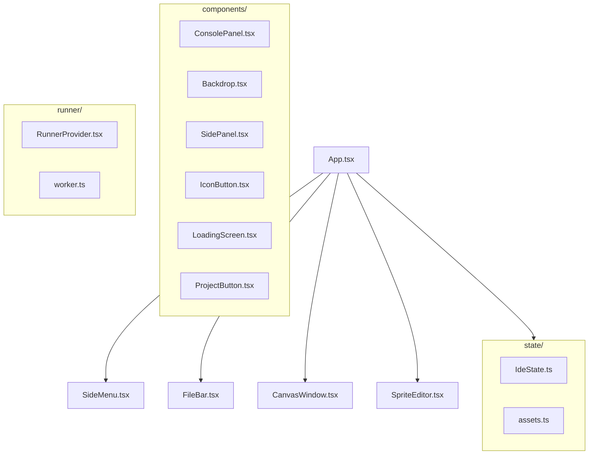
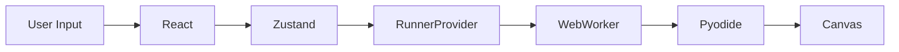

# pi3 Project Documentation

This folder contains detailed specifications for all major modules of the pi3 project.

## Documentation Index

| # | Document | Description |
|---|----------|-------------|
| 01 | [Project Overview](01-project-overview.md) | High-level architecture, system design, tech stack |
| 02 | [State Management](02-state-management.md) | Zustand stores, Editor/IDE/Runner state |
| 03 | [Runner Module](03-runner-module.md) | WebWorker, Pyodide, execution modes |
| 04 | [Graphics Module](04-graphics-module.md) | Python graphics API, Actor system |
| 05 | [UI Components](05-ui-components.md) | React components, layout, interactions |
| 06 | [Storage & Persistence](06-storage.md) | IndexedDB, ZIP format, auto-save |
| 07 | [Linter](07-linter.md) | Python static analysis |
| 08 | [Sprite Editor](08-sprite-editor.md) | Konva-based vector editor |
| 09 | [PWA & Service Worker](09-pwa.md) | Offline caching, installation |
| 10 | [Hooks](10-hooks.md) | useAutoSave, usePanels, useProjects, useRunButton |
| 11 | [Internationalization](11-i18n.md) | i18next, translation keys |
| 12 | [Code Editor](12-code-editor.md) | CodeMirror 6, theme, indentation guides |
| 13 | [Python Assets](13-python-assets.md) | shim.py, transform.py, linter.py |
| 14 | [Roadmap](../ROADMAP.md) | Planned and in-progress features |

## Quick Reference

### Project Structure

### Key Technologies
- **React 19** - UI framework
- **TypeScript** - Type safety
- **Zustand** - State management
- **CodeMirror 6** - Code editor
- **Pyodide** - Python in browser (WebAssembly)
- **Konva** - Canvas graphics (sprite editor)
- **IndexedDB** - Local storage
- **i18next** - Internationalization

### Data Flow

### Example Projects
- hello world - Basic print
- input - User input handling
- p5 - p5.js-style graphics
- snake - Snake game with config
- sokoban - Sokoban puzzle game
- asteroids - Asteroids with sprites

## Reading Order

For understanding the codebase:
1. Start with [01 - Project Overview](01-project-overview.md) for architecture
2. Read [02 - State Management](02-state-management.md) to understand data flow
3. Review [03 - Runner Module](03-runner-module.md) for Python execution
4. Explore [04 - Graphics Module](04-graphics-module.md) for the game API
5. Check [05 - UI Components](05-ui-components.md) for React structure

For implementation details:
- Storage: [06 - Storage & Persistence](06-storage.md)
- Code editing: [12 - Code Editor](12-code-editor.md)
- Internationalization: [11 - i18n](11-i18n.md)

---

*Last updated: 2026-04-30*