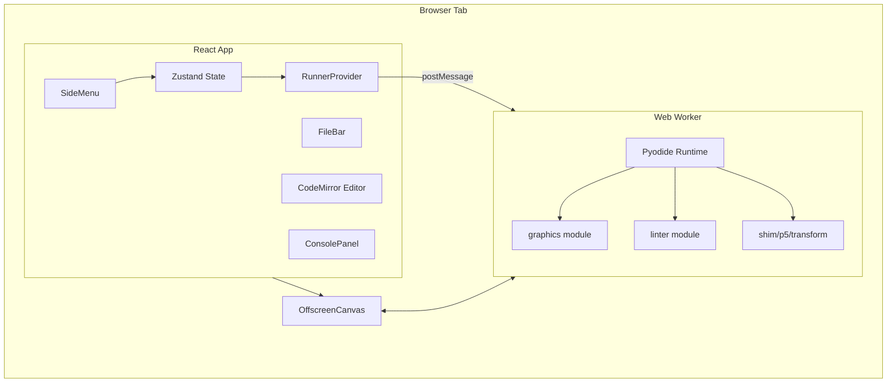
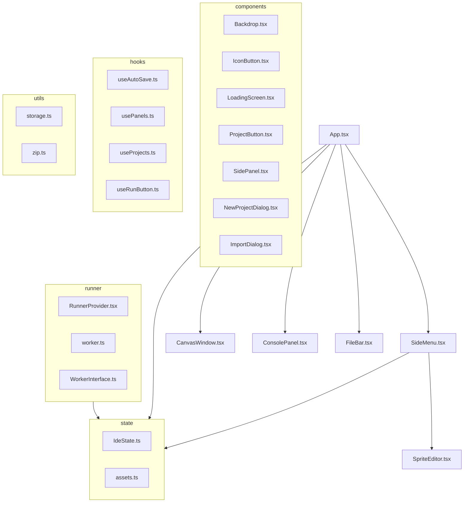
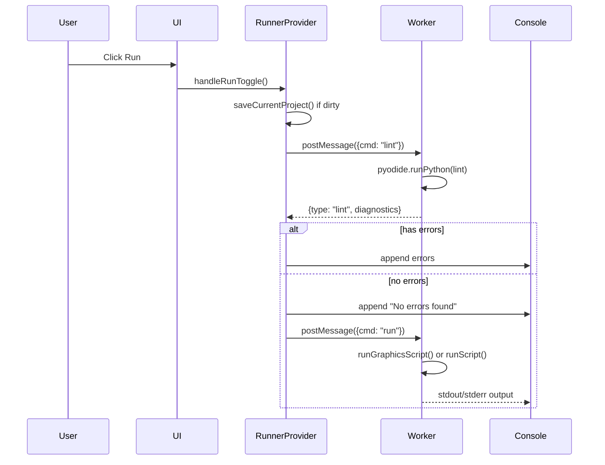
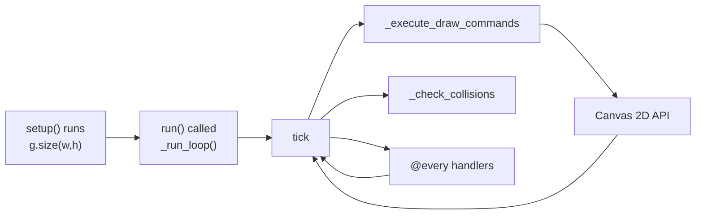

> **Archived — written 2026-04-30. Predates significant codebase changes (API-v1 rework, decomposition, save-flow overhaul, error system, pixel editor). Verify against current code before relying on any detail. [CLAUDE.md](../../CLAUDE.md) is authoritative for architecture notes.**

# pi3 - Project Specification

**Version:** 1.0
**Last Updated:** 2026-04-30
**Language:** TypeScript + Python
**Runtime:** Pyodide (WebAssembly)

---

## 1. Project Overview

### 1.1 Purpose

**pi3** is a browser-based Python IDE designed for teaching children ages 10-12 how to code. It requires zero installation — students simply open a URL and begin coding. The system supports plain Python, interactive input, and game development through an Actor-based graphics API.

### 1.2 Name Origin

- **Chemistry**: Phosphorus Triiodide (PI₃) — an unstable, pyrotechnic compound that reacts dramatically on contact, like running code
- **Math**: References π (pi) and the π ≈ 3.14 approximation
- **Tech**: Python + Graphics + Chemistry pun

### 1.3 Target Users

- Primary: Children ages 10-12 learning Python for the first time
- Secondary: Instructors overseeing student progress

### 1.4 Technical Stack

| Component | Technology |
|-----------|------------|
| Frontend Framework | React 19 + TypeScript |
| Bundler | Vite |
| Styling | Tailwind CSS |
| State Management | Zustand |
| Code Editor | CodeMirror 6 |
| Python Runtime | Pyodide v0.26.4 (WebAssembly) |
| Graphics | Konva (Sprite Editor), HTML5 Canvas (Runtime) |
| Testing | Jest + Puppeteer |
| Storage | IndexedDB |
| PWA | Service Worker + Web App Manifest |

---

## 2. System Architecture

### 2.1 High-Level Architecture



### 2.2 Module Structure



### 2.3 Data Flow

#### Running Python Code



#### Graphics Rendering



---

## 3. Frontend Components

### 3.1 App (Root Component)

**File:** `src/App.tsx`

**Purpose:** Root layout orchestrating all major UI regions.

**Sub-components:**
- LoadingScreen (when Pyodide not ready)
- SideMenu (navigation rail)
- FileBar (file tabs)
- CodeMirror editor
- ConsolePanel (right side)
- CanvasWindow (floating)

**State Dependencies:**
- `useEditor` - currentFile, project, dirtyFiles
- `useIde` - saveCurrentProject
- `useRunner` - ready

**Key Features:**
- Service Worker registration for Pyodide caching
- Ctrl+S keyboard shortcut for save
- CodeMirror with Python language support
- Soft line wrapping (EditorView.lineWrapping)
- Indentation guide coloring (6 levels)

### 3.2 SideMenu

**File:** `src/SideMenu.tsx`

**Purpose:** Navigation rail with collapsible panels for Projects, Assets, and Settings.

**Sub-panels:**
- ProjectsPanel - Example list + user projects
- AssetsPanel - Selected/available sprite assets
- SettingsPanel - Auto-save, Vim mode, hitboxes toggles

**Key Features:**
- Lazy-loaded SpriteEditor (React.lazy)
- Projects auto-fork on edit (if no currentProjectId)
- Asset selection toggles assets in project
- Auto-save on 60-second interval
- Import/Export project as ZIP

**State Dependencies:**
- `useEditor` - project, currentProjectId, dirtyFiles, toggleAsset, changeCurrentProject
- `useIde` - projects, userProjects, saveCurrentProject, importProjectFromFile
- `useRunner` - ready
- `useRunButton` - running, isP5, handleRunToggle
- `usePanels` - activePanel, isOpen, togglePanel, closePanels

### 3.3 FileBar

**File:** `src/FileBar.tsx`

**Purpose:** Tab bar for open files with create/rename/delete functionality.

**Components:**
- FileTab - Individual file tab with:
  - Click to select
  - Double-click to rename
  - Close button (with confirmation)
  - Dirty indicator (yellow dot)
- NewFileTab - Creates new untitled.py file

**State Dependencies:**
- `useEditor` - currentFile, project.files, changeCurrentFile, changeFile, deleteFile, dirtyFiles

### 3.4 ConsolePanel

**File:** `src/components/ConsolePanel.tsx`

**Purpose:** Display program output and handle input prompts.

**Features:**
- Color-coded output (stdout=green, stderr=red)
- Copy to clipboard button
- Clear console button
- Input prompt when Python requests input()
- Auto-scroll to bottom on new output
- Output batching via requestAnimationFrame

**State Dependencies:**
- `useRunner` - output, inputPrompt, respondToInput, clear

### 3.5 CanvasWindow

**File:** `src/CanvasWindow.tsx`

**Purpose:** Floating, draggable canvas for graphics output.

**Features:**
- Drag by title bar
- Shows only when graphics running (canvasActive)
- OffscreenCanvas transfer for GPU-accelerated rendering
- Opacity transition on show/hide

**State Dependencies:**
- `useRunner` - attachCanvas, canvasActive

### 3.6 SpriteEditor

**File:** `src/SpriteEditor.tsx`

**Purpose:** Konva-based vector sprite editor for creating SVG sprites.

**Tools:**
| Tool | Icon | Behavior |
|------|------|----------|
| select | MdNorthWest | Click to select, drag to move/resize |
| rect | MdCropSquare | Click+drag to create rectangle |
| ellipse | MdCircle | Click+drag to create ellipse |
| line | MdLineAxis | Click start, click end (double-click to finish) |
| freehand | MdEdit | Draw path, release to finish |
| polygon | MdPolyline | Click to add vertices, Enter/double-click to close |
| text | MdTextFields | Prompt for text, place at click position |

**Features:**
- SVG save/load
- Color picker (16-color palette + custom)
- Stroke width (0-4)
- Undo/Redo (history stack)
- Delete selected shape
- Center crosshair indicator
- Polygon/freehand tool hints

**Data Format:**
```typescript
type ShapeData =
  | { kind: "rect"; x, y, width, height, fill, stroke, strokeWidth }
  | { kind: "ellipse"; x, y, radiusX, radiusY, fill, stroke, strokeWidth }
  | { kind: "line"; points: number[], fill, stroke, strokeWidth }
  | { kind: "freehand"; points: number[], closed: boolean, fill, stroke, strokeWidth }
  | { kind: "polygon"; points: number[], closed: boolean, fill, stroke, strokeWidth }
  | { kind: "text"; x, y, text, fontSize, fill, stroke, strokeWidth }
```

---

## 4. State Management

### 4.1 Zustand Stores

#### useEditor Store

**File:** `src/state/IdeState.ts`

```typescript
type EditorState = {
  currentFile: string;
  project: Project;
  currentProjectId: string | null;
  dirtyFiles: Set<string>;
  lastSaveTime: number;

  changeCurrentFile: (name: string) => void;
  changeCurrentProject: (project: Project, projectId?: string) => void;
  changeFile: (name: string, text: string) => void;
  saveFile: (name: string) => void;
  deleteFile: (name: string) => void;
  changeAsset: (name: string, url: string) => void;
  toggleAsset: (name: string, url: string) => void;
  renameFile: (oldName: string, newName: string) => void;
  markClean: () => void;
  updateLastSaveTime: () => void;
};
```

**Initial State:**
- project = Examples["hello world"]
- currentFile = "main.py"
- currentProjectId = null
- dirtyFiles = new Set()
- lastSaveTime = Date.now()

**Auto-fork Behavior:** When editing an example (currentProjectId === null), changing file content automatically forks to a new dirty project.

#### useIde Store

```typescript
type IdeState = {
  activePanel: PanelId;
  assets: Record<string, Blob>;
  projects: Record<string, Project>;
  userProjects: UserProject[];
  loading: boolean;
  showHitboxes: boolean;

  setActivePanel: (panel: PanelId) => void;
  togglePanel: (panel: Exclude<PanelId, null>) => void;
  closePanels: () => void;
  loadUserProjects: () => Promise<void>;
  createNewProject: (name: string) => Promise<UserProject>;
  deleteUserProject: (id: string) => Promise<void>;
  renameUserProject: (id: string, newName: string) => Promise<void>;
  forkExample: (exampleName: string, exampleProject: Project, newName?: string) => Promise<UserProject>;
  saveCurrentProject: () => Promise<void>;
  exportProject: (id: string) => Promise<void>;
  importProject: (zipData: ArrayBuffer, name?: string) => Promise<UserProject>;
  downloadProject: (id: string) => Promise<void>;
  importProjectFromFile: (file: File) => Promise<UserProject>;
  setShowHitboxes: (show: boolean) => void;
};
```

**Projects:** Built-in example projects loaded from static imports:
- hello world
- input
- p5
- snake
- sokoban
- asteroids

**UserProjects:** Stored in IndexedDB via projectStorage singleton.

### 4.2 Runner Store

**File:** `src/runner/RunnerProvider.tsx`

```typescript
type RunnerState = {
  ready: boolean;
  running: boolean;
  output: OutputLine[];
  inputPrompt: string | null;
  isP5: boolean;
  canvasActive: boolean;
  lintErrors: LintDiagnostic[];
};
```

**Output Batching:** Lines are accumulated and flushed on requestAnimationFrame to prevent excessive re-renders.

---

## 5. Python Runtime System

### 5.1 Worker Architecture

**File:** `src/runner/worker.ts`

**Initialization Flow:**
```
1. ensurePyodide() → load from local or CDN
2. initPyodide() → write modules to FS:
   - /_shim_p5.py (p5 compatibility)
   - /transform.py (AST transformer)
   - /actors.py (Actor system)
   - /graphics/__init__.py (new graphics API)
   - /graphics/actors/__init__.py (Actor class)
   - /graphics/actors/config.py (@method decorator)
   - /linter.py (Python linter)
3. Set up _ide_post_output, _ide_post_input_request
4. postMessage({ type: "ready" })
```

**Canvas Attachment:**
```
1. RunnerProvider calls attachCanvas(canvas)
2. canvas.transferControlToOffscreen() creates OffscreenCanvas
3. Transfer via postMessage({ cmd: "attach_canvas" })
4. Worker sets __ide_canvas global
```

### 5.2 Execution Modes

#### Plain Python (non-graphics)
```
User code → transform() → wrap in MAIN() → exec()
```
- Input rewritten to async console.ainput()
- No canvas interaction

#### P5 Compatibility Mode
```
User code → has setup/draw? → _run_sketch()
```
- Uses shim.py canvas API
- Events injected via _inject_event()

#### New Graphics Mode
```
User code → import graphics → g.run()
```
- Uses graphics/__init__.py API
- Actors via graphics.actors.Actor
- Event handlers registered via decorators

### 5.3 Lint Flow

```
User clicks Run
       ↓
useRunButton.handleRunToggle()
       ↓
lint(code, filename) → RunnerProvider.lint()
       ↓
postMessage({ cmd: "lint", code, filename })
       ↓
worker.ts: lint command handler
       ↓
pyodide.runPythonAsync(`lint(_lint_code, _lint_filename)`)
       ↓
postMessage({ type: "lint", diagnostics })
       ↓
RunnerProvider._onMessage({ type: "lint" })
       ↓
setLintErrors(diagnostics) → output appended to console
```

### 5.4 Interrupt Mechanism

```
User clicks Stop
       ↓
interrupt() → returns Promise
       ↓
postMessage({ cmd: "interrupt" })
       ↓
Worker: shim.noLoop(), graphics.stop()
       ↓
postMessage({ type: "interrupt_ack" })
       ↓
Promise resolves
```

Also uses SharedArrayBuffer interrupt buffer for faster termination.

---

## 6. Graphics Module

### 6.1 Module Structure

```
graphics/
├── __init__.py      # g namespace
└── actors/
    ├── __init__.py  # Actor class
    └── config.py    # @method decorator + from_cfg()
```

### 6.2 graphics/__init__.py

**Global State:**
```python
_canvas = None           # OffscreenCanvas
_ctx = None              # Canvas 2D context
_width = 300             # Canvas width
_height = 300            # Canvas height
_running = False         # Loop active flag
_stop_requested = False  # Stop requested flag
_loop_generation = 0     # Tick generation counter

_draw_commands = []      # Queued draw operations
_fill_color = (255,255,255)
_stroke_color = (0,0,0)
_stroke_width = 1

_setup_func = None       # User's setup() function

_key_handlers = {}       # key → [handlers]
_mouse_handlers = []    # [("move"|"click", handler)]
_every_handlers = {}     # frames → [[counter, handler]]
_collision_handlers = [] # [(actor_class, handler)]

_mouse_x = 0
_mouse_y = 0
_keys_down = set()
_frame_count = 0
_target_fps = 60
_pending_timer_id = None
_show_hitboxes = False
```

**Draw Commands:** Deferred commands executed each frame:
- circle, ellipse, rect, line, point
- text, text_size, text_align
- fill, no_fill, stroke, no_stroke, stroke_width, background
- push, pop, translate, rotate, scale
- image, image_mode, rect_mode

**Decorators:**
```python
@g.every(5)           # Run every 5 frames
@g.on_key_press("w", "arrow_up")  # Key handlers
@g.on_mouse_move       # Mouse move handler
@g.on_mouse_click      # Mouse click handler
@g.setup              # Setup function
@g.on_collide(ActorClass)  # Collision with specific type
@g.on_collide_any(*ActorClasses)  # Collision with any type
```

### 6.3 Drawing API

| Function | Signature | Description |
|----------|-----------|-------------|
| size | `size(w, h)` | Set canvas dimensions |
| width | `width() → int` | Get canvas width |
| height | `height() → int` | Get canvas height |
| circle | `circle(x, y, r)` | Draw circle |
| rect | `rect(x, y, w, h)` | Draw rectangle |
| ellipse | `ellipse(x, y, w, h=None)` | Draw ellipse |
| line | `line(x1, y1, x2, y2)` | Draw line |
| point | `point(x, y)` | Draw point |
| text | `text(s, x, y)` | Draw text |
| text_size | `text_size(n)` | Set font size |
| text_align | `text_align(h, v=None)` | Set alignment |
| fill | `fill(r, g=None, b=None)` | Set fill color |
| no_fill | `no_fill()` | Disable fill |
| stroke | `stroke(r, g=None, b=None)` | Set stroke color |
| no_stroke | `no_stroke()` | Disable stroke |
| stroke_width | `stroke_width(w)` | Set stroke width |
| background | `background(r, g=None, b=None)` | Clear canvas |
| push | `push()` | Save state |
| pop | `pop()` | Restore state |
| translate | `translate(x, y)` | Move origin |
| rotate | `rotate(angle)` | Rotate |
| scale | `scale(x, y=None)` | Scale |
| image | `image(img, x, y, w=None, h=None)` | Draw image |

### 6.4 Input API

| Function | Signature | Description |
|----------|-----------|-------------|
| key_pressed | `key_pressed(key) → bool` | Check key |
| mouse_x | `mouse_x() → float` | Mouse X |
| mouse_y | `mouse_y() → float` | Mouse Y |
| frame_rate | `frame_rate(fps)` | Set FPS |
| random | `random(low, high=None) → float` | Random float |
| random_color | `random_color() → str` | Random color name |

### 6.5 Actor System

**File:** `src/assets/python/graphics/actors/__init__.py`

```python
class Actor:
    _registry = []      # All actors
    _id_counter = 0     # Auto-increment ID

    # Properties
    x, y               # Position (read-only via property)
    angle              # Rotation angle
    visible            # Visibility flag
    collidable         # Collision flag

    # Methods
    set_coords(x, y)   # Set position
    get_coords() → (x, y)
    point_to(x, y)     # Point at coordinate
    move_forward(d)     # Move in facing direction
    move_left(d)       # Move left
    move_right(d)      # Move right
    move_up(d)         # Move up
    move_down(d)       # Move down
    set_speed(vx, vy)  # Set velocity
    rotate_clockwise(deg)
    get_angle()
    set_angle(deg)
    hide()             # Make invisible and non-collidable
    ghost()            # Make visible but non-collidable
    die()              # Mark dead, remove from registry
    is_alive() → bool
    bring_to_front()
    send_to_back()
    collides_with(other) → bool
```

**Factory:**
```python
Actor.from_cfg(module)  # From config module
```

**Config Pattern:**
```python
# snake_cfg.py
from graphics.actors.config import method

x = 10
y = 10
tail = []

@method
def draw(self):
    g.fill(0, 255, 0)
    g.rect(self.x, self.y, 20, 20)

@method
def update(self):
    self.tail.append((self.x, self.y))
```

### 6.6 @method Decorator

**File:** `src/assets/python/graphics/actors/config.py`

```python
def method(func):
    """Mark function as actor method for from_cfg()"""
    func._is_actor_method = True
    return func

def from_cfg(module) → Actor:
    """Create Actor from configuration module"""
    # - x, y → initial coords via set_coords()
    # - @method functions → bound to actor
    # - Other vars → actor attributes
```

---

## 7. Project Management

### 7.1 Storage

**File:** `src/utils/storage.ts`

**Class:** `ProjectStorage`

**Storage:** IndexedDB with object store "projects"

**Schema:**
```typescript
interface StoredProject extends Project {
  id: string;          // "proj_{timestamp}_{random}"
  name: string;
  createdAt: string;   // ISO timestamp
  updatedAt: string;   // ISO timestamp
  isExample: boolean;
  currentFile?: string;
}

interface Project {
  files: Record<string, string>;
  currentFile?: string;
  assets: Record<string, string>;  // name → dataURL
}
```

**Indexes:**
- name (for listing)
- updatedAt (for sorting)
- isExample (for filtering)

### 7.2 ZIP Format

**File:** `src/utils/zip.ts`

**Structure:**
```
project.zip/
├── project.json       # Manifest
├── files/
│   ├── main.py        # Source files
│   └── ...
└── assets/
    ├── sprite.svg      # Asset files
    └── ...
```

**Manifest:**
```json
{
  "id": "proj_xxx",
  "name": "My Project",
  "updatedAt": "2026-...",
  "currentFile": "main.py",
  "files": ["main.py", "helper.py"],
  "assets": ["sprite.svg"]
}
```

### 7.3 Auto-Save

**File:** `src/hooks/useAutoSave.ts`

**Interval:** 60 seconds

**Trigger:** When dirtyFiles.size > 0 and currentProjectId exists

**Action:**
1. saveCurrentProject()
2. markClean()
3. updateLastSaveTime()

---

## 8. Linter

### 8.1 Python Linter

**File:** `src/assets/python/linter.py`

**Checks:**

| Code | Check | Severity |
|------|-------|----------|
| E999 | Syntax error | error |
| E999Colon | Missing colon | error |
| E999Unclosed | Unclosed bracket | error |
| E999Unterminated | Unterminated string | error |
| E999Invalid | Invalid syntax | error |
| E999EOL | Premature EOL | error |
| E999Unmatched | Unmatched brackets | error |
| E999Assign | Cannot assign | error |
| E101 | Indentation contains tabs | error |
| E111 | Indentation not multiple of 4 | error |
| E225 | Unsupported operand types | error |
| E225Call | Method argument type mismatch | error |
| E301 | Missing blank lines between defs | error |
| E303 | Too many blank lines | error |
| E501 | Line too long (>100) | error |
| F401 | Imported but unused | error |
| F821 | Undefined name | error |

**Translation Keys:** All messages use i18n keys like `linter.E999`, `linter.E225`, etc.

### 8.2 Lint Flow

```
handleRunToggle()
    ↓
lint(code, filename) → postMessage({ cmd: "lint" })
    ↓
worker.ts: pyodide.runPythonAsync(`lint(code, filename)`)
    ↓
Post diagnostics via postMessage({ type: "lint", diagnostics })
    ↓
RunnerProvider._onMessage handler
    ↓
setLintErrors + append to output
```

---

## 9. Internationalization

### 9.1 Configuration

**File:** `src/i18n/index.ts`

**Supported Languages:** en, ru

**Detection:** localStorage → navigator

**Namespace:** translation

### 9.2 Translation Keys

| Namespace | Keys | Description |
|-----------|------|-------------|
| app | loading, loadingHint, copyConsole, clearConsole, inputPlaceholder | App-level |
| sideMenu | close, run, stop, projects, assets, settings... | SideMenu panel |
| fileBar | deleteConfirm, renameFile, closeFile... | File operations |
| spriteEditor | title, select, tools, colors, undo/redo... | Sprite editor |
| canvas | label | Canvas window |
| console | checking, syntaxError, noErrors... | Console output |
| linter | E999, E101, E111, E225... | Lint messages |
| errors | cannotFork, notExample | Error messages |

---

## 10. PWA & Service Worker

### 10.1 Manifest

**File:** `public/manifest.json`

**Features:**
- standalone display mode
- landscape orientation
- SVG icons (192x192, 512x512, maskable)
- Categories: education, utilities

### 10.2 Service Worker

**File:** `public/sw.js`

**Caching Strategy:**
- **App Shell:** Cache-first (index.html, manifest, icons)
- **Pyodide:** Cache-first with network fallback
- **HTML:** Network-first with cache fallback

**Cache Name:** `webide-v2`

**Cached Assets:**
- Pyodide v0.26.4 (pyodide.mjs, pyodide.js)
- App shell files

---

## 11. Code Editor

### 11.1 CodeMirror Configuration

**File:** `src/editor/theme.ts`

**Extensions:**
- `python()` - Python language
- `EditorState.tabSize.of(4)` - 4-space tabs
- `indentUnit.of("    ")` - 4-space indent
- `bracketMatching()` - Match brackets
- `indentOnInput()` - Auto-indent
- `lineNumbers()` - Line numbers
- `highlightActiveLine()` - Active line highlight
- `drawSelection()` - Selection visible
- `highlightSpecialChars()` - Show special chars
- `indentationGuideField` - Colored indent guides
- `webideTheme` - Custom theme
- `EditorView.lineWrapping` - Soft wrap
- `autocompletion({ defaultKeymap: true })` - Autocomplete
- `keymap.of([{ key: "Tab", run: acceptCompletion }])` - Tab completion

### 11.2 Indentation Guide Colors

| Level | Spaces | Color |
|-------|--------|-------|
| 1 | 1-4 | #e0f2fe (lightest) |
| 2 | 5-8 | #bae6fd |
| 3 | 9-12 | #7dd3fc |
| 4 | 13-16 | #38bdf8 |
| 5 | 17-20 | #0ea5e9 |
| 6 | 21+ | #0284c7 (darkest) |

---

## 12. Examples

### 12.1 Available Examples

| Name | Files | Assets | Description |
|------|-------|--------|-------------|
| hello world | main.py | - | Basic print statement |
| input | input.py | - | User input handling |
| p5 | p5.py | - | p5.js-style graphics |
| snake | snake.py, snake_cfg.py, apple_cfg.py | - | Snake game |
| sokoban | sokoban.py | 6 tiles | Sokoban puzzle |
| asteroids | main.py | 4 SVG sprites | Asteroids game |

### 12.2 Example Loading

Examples are imported as raw strings at build time:
```typescript
import HelloWorld from "../assets/examples/hello_world/hello_world.py?raw";
```

---

## 13. Testing

### 13.1 E2E Tests (Puppeteer)

**Location:** `tests/puppeteer/`

**Count:** 12 tests

**Coverage:**
- Core UI loading
- Python execution
- p5 sketch rendering
- Asset panel
- Project panel
- Error handling
- Console output
- Sprite editor
- Hello World example
- Snake example
- Bounce example
- Sokoban example

### 13.2 Unit Tests (Jest)

**Location:** `tests/unit/`

**Count:** 39 tests

**Coverage:**
- State management
- Worker communication
- Storage utilities
- ZIP utilities

---

## 14. Key Technical Decisions

### 14.1 Why Python-based Linter?

- No WASM download (~1MB savings)
- Simpler architecture
- Easier to customize for student-friendly messages
- For 100-200 line beginner projects, extensive rule set is overkill

### 14.2 Why Two Graphics APIs?

**Old (shim.py):** p5.js-style compatibility, used by older examples

**New (graphics/):** Clean actor-based API, better for games

Both run via the same Pyodide worker.

### 14.3 _loop_generation Invalidation

Old ticks are invalidated by incrementing `_loop_generation`:
- Worker init: +1
- runGraphicsScript: +1
- g.run(): +1

Each run gets unique generations (3, 6, 9, 12...), preventing old ticks from executing in new runs.

### 14.4 Asset Loading

SVG assets can't be decoded by `createImageBitmap` in Worker context.

**Solution:** Create ImageBitmaps in main thread, transfer via postMessage:
```
RunnerProvider (main thread)
    ↓ creates ImageBitmap via Image+canvas
    ↓ postMessage with transferable
worker.ts
    ↓ receives ImageBitmap
    ↓ sets _asset_bitmaps
```

---

## 15. File Structure Summary

```
src/
├── App.tsx                    # 112 lines
├── SideMenu.tsx               # 539 lines
├── FileBar.tsx               # 201 lines
├── CanvasWindow.tsx           # 66 lines
├── SpriteEditor.tsx          # 1068 lines
├── IconButton.tsx             # 53 lines (duplicate, old)
├── index.css                  # CSS entry
├── main.tsx                   # React entry
├── vite-env.d.ts
│
├── components/
│   ├── Backdrop.tsx           # 18 lines
│   ├── ConsolePanel.tsx       # 94 lines
│   ├── IconButton.tsx         # 53 lines
│   ├── LoadingScreen.tsx      # 20 lines
│   ├── ProjectButton.tsx      # 67 lines
│   ├── SidePanel.tsx          # 77 lines
│   └── dialogs/
│       ├── ImportDialog.tsx   # 45 lines
│       └── NewProjectDialog.tsx # 58 lines
│
├── state/
│   ├── IdeState.ts            # 399 lines
│   └── assets.ts              # 14 lines
│
├── runner/
│   ├── RunnerProvider.tsx     # 402 lines
│   ├── WorkerInterface.ts     # 52 lines
│   └── worker.ts              # 425 lines
│
├── hooks/
│   ├── useAutoSave.ts         # 24 lines
│   ├── usePanels.ts           # 18 lines
│   ├── useProjects.ts         # 62 lines
│   └── useRunButton.ts        # 68 lines
│
├── utils/
│   ├── storage.ts             # 384 lines
│   └── zip.ts                # 192 lines
│
├── editor/
│   └── theme.ts              # 86 lines
│
├── i18n/
│   ├── index.ts              # 30 lines
│   ├── en.json               # 112 lines
│   └── ru.json               # 112 lines
│
└── assets/
    ├── python/
    │   ├── graphics/
    │   │   ├── __init__.py   # 787 lines
    │   │   └── actors/
    │   │       ├── __init__.py # 279 lines
    │   │       └── config.py  # 103 lines
    │   └── linter.py         # 862 lines
    │
    ├── examples/
    │   ├── shim.py           # 721 lines
    │   ├── transform.py      # 405 lines
    │   ├── actors.py         # (not read)
    │   ├── hello_world/
    │   ├── input/
    │   ├── p5/
    │   ├── snake/
    │   ├── sokoban/
    │   ├── bounce/
    │   └── asteroids/
    │
    └── sprites/             # Packaged sprite assets
```

---

*End of Specification*