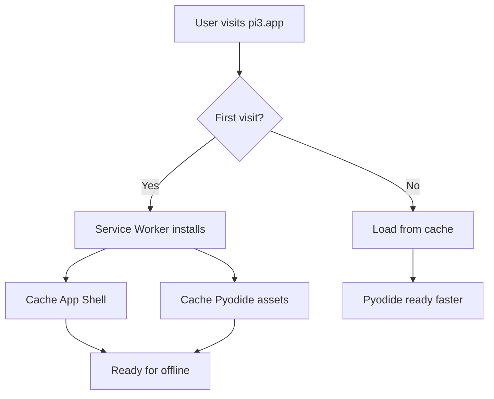

> **Archived — written 2026-04-30. Predates significant codebase changes (API-v1 rework, decomposition, save-flow overhaul, error system, pixel editor). Verify against current code before relying on any detail. [CLAUDE.md](../../CLAUDE.md) is authoritative for architecture notes.**

# PWA & Service Worker Specification

**Module:** public/
**Files:** `public/sw.js`, `public/manifest.json`, icons

---

## 1. Overview

The app is a Progressive Web App (PWA) that can be installed on user's devices and works offline after initial caching.

**Features:**
- Service Worker for asset caching
- Web App Manifest for installation
- Pyodide runtime caching for faster subsequent loads

---

## 2. Manifest

**File:** `public/manifest.json`

```json
{
  "name": "pi3 - Learn to Code with Python",
  "short_name": "pi3",
  "description": "A browser-based Python IDE for teaching kids coding - zero installation, runs in your browser",
  "start_url": "/",
  "display": "standalone",
  "background_color": "#164e63",
  "theme_color": "#0e7490",
  "orientation": "landscape",
  "icons": [
    {
      "src": "/icon-192.svg",
      "sizes": "192x192",
      "type": "image/svg+xml",
      "purpose": "any"
    },
    {
      "src": "/icon-512.svg",
      "sizes": "512x512",
      "type": "image/svg+xml",
      "purpose": "any"
    },
    {
      "src": "/icon-maskable.svg",
      "sizes": "512x512",
      "type": "image/svg+xml",
      "purpose": "maskable"
    }
  ],
  "categories": ["education", "utilities"],
  "lang": "en"
}
```

### 2.1 Key Properties

| Property | Value | Description |
|----------|-------|-------------|
| name | pi3 - Learn to Code with Python | Full app name |
| short_name | pi3 | Short name for home screen |
| display | standalone | Opens without browser chrome |
| orientation | landscape | Preferred orientation |
| background_color | #164e63 | Splash screen background |
| theme_color | #0e7490 | Status bar color |
| categories | education, utilities | App categorization |

---

## 3. Service Worker

**File:** `public/sw.js`

### 3.1 Cache Configuration

```javascript
const CACHE_NAME = 'webide-v2';
const PYODIDE_VERSION = '0.26.4';

const PYODIDE_ASSETS = [
  `https://cdn.jsdelivr.net/pyodide/v${PYODIDE_VERSION}/full/pyodide.mjs`,
  `https://cdn.jsdelivr.net/pyodide/v${PYODIDE_VERSION}/full/pyodide.js`,
];

const APP_SHELL = [
  '/',
  '/index.html',
  '/manifest.json',
  '/favicon.svg',
  '/icon-192.svg',
  '/icon-512.svg',
];
```

### 3.2 Cache Versioning

The cache name `webide-v2` allows:
1. New versions to create fresh caches
2. Old caches to be deleted on activation

```javascript
self.addEventListener('activate', (event) => {
  event.waitUntil(
    caches.keys().then((cacheNames) => {
      return Promise.all(
        cacheNames
          .filter((name) => name !== CACHE_NAME)
          .map((name) => caches.delete(name))
      );
    })
  );
  self.clients.claim();
});
```

### 3.3 Install Event

```javascript
self.addEventListener('install', (event) => {
  event.waitUntil(
    caches.open(CACHE_NAME).then(async (cache) => {
      console.log('[SW] Caching app shell and libraries');
      try {
        await cache.addAll(APP_SHELL);
        console.log('[SW] App shell cached');
      } catch (e) {
        console.log('[SW] App shell caching failed:', e);
      }
      await cache.addAll(ALL_ASSETS);
      console.log('[SW] Libraries cached');
    })
  );
  self.skipWaiting();
});
```

### 3.4 Fetch Strategy

**Pyodide Assets:**
- Cache-first strategy
- Network fallback
- Cached on first request

**App Shell:**
- Cache-first for cached assets
- Network-first for HTML (allows updates)

**All other requests:**
- Network only

```javascript
self.addEventListener('fetch', (event) => {
  const url = new URL(event.request.url);

  const isPyodide = url.href.includes('cdn.jsdelivr.net/pyodide');
  const isAppShell = APP_SHELL.includes(url.pathname);

  if (isPyodide) {
    // Cache-first for Pyodide
    event.respondWith(
      caches.match(event.request).then((cachedResponse) => {
        if (cachedResponse) {
          return cachedResponse;
        }
        return fetch(event.request).then((response) => {
          if (response.ok) {
            const responseClone = response.clone();
            caches.open(CACHE_NAME).then((cache) => {
              cache.put(event.request, responseClone);
            });
          }
          return response;
        }).catch(() => {
          return new Response('Network error', { status: 408 });
        });
      })
    );
    return;
  }

  if (isAppShell || event.request.headers.get('accept')?.includes('text/html')) {
    // Network-first for app shell / HTML
    event.respondWith(
      caches.match(event.request).then((cachedResponse) => {
        if (cachedResponse) {
          return cachedResponse;
        }
        return fetch(event.request).then((response) => {
          if (response.ok) {
            const responseClone = response.clone();
            caches.open(CACHE_NAME).then((cache) => {
              cache.put(event.request, responseClone);
            });
          }
          return response;
        }).catch(() => {
          return caches.match('/index.html');
        });
      })
    );
  }
});
```

---

## 4. Caching Flow



### 4.1 Icon Files

| File | Size | Purpose |
|------|------|---------|
| icon-192.svg | 192x192 | Small devices |
| icon-512.svg | 512x512 | Large devices |
| icon-maskable.svg | 512x512 | Maskable (Android) |
| favicon.svg | Any | Browser tab |

### 4.2 Icon Design

The icons display "pi³" branding with the cyan/teal color scheme.

---

## 5. Loading Screen

**File:** `src/components/LoadingScreen.tsx`

While Pyodide is loading, the loading screen shows:
- pi³ logo
- Spinner animation
- "Loading Python runtime..." text
- Hint text about caching

---

## 6. Registration

**File:** `src/App.tsx`

```typescript
useEffect(() => {
  if ('serviceWorker' in navigator) {
    navigator.serviceWorker.register('/sw.js').then(
      (registration) => {
        console.log('[App] Service Worker registered:', registration.scope);
      },
      (error) => {
        console.log('[App] Service Worker registration failed:', error);
      }
    );
  }
}, []);
```

---

## 7. Pyodide Caching Flow

```
User visits pi3.app
    ↓
Service Worker installs
    ↓
Caches App Shell + Pyodide assets
    ↓
Pyodide loads from cache on subsequent visits
    ↓
Worker initializes Pyodide from cached files
```

---

## 8. Offline Behavior

After initial load:
- App shell loads from cache
- Pyodide loads from cache
- All assets (sprites, examples) load from cache
- User code runs normally

Only requirement: Initial load needs network for Pyodide CDN.

---

## 9. Cache Invalidation

### 9.1 Version Change

When cache version changes (e.g., `webide-v3`):
1. New service worker installs with new cache
2. Old caches are deleted
3. Fresh copy of all assets

### 9.2 Force Update

Users can force refresh (Ctrl+Shift+R) to get latest version.

---

## 10. Security

### 10.1 SharedArrayBuffer

The interrupt mechanism uses `SharedArrayBuffer` which requires:
- `Cross-Origin-Opener-Policy: same-origin`
- `Cross-Origin-Embedder-Policy: require-corp`

These headers are typically set at the server/CDN level.

### 10.2 HTTPS Required

Service Workers only work on HTTPS or localhost.

---

*End of PWA & Service Worker Specification*