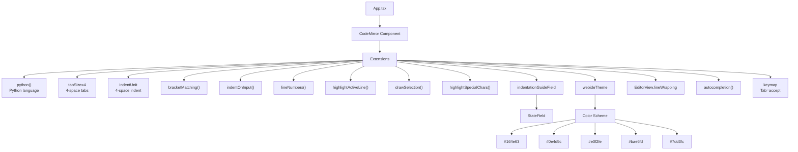

> **Archived — written 2026-04-30. Predates significant codebase changes (API-v1 rework, decomposition, save-flow overhaul, error system, pixel editor). Verify against current code before relying on any detail. [CLAUDE.md](../../CLAUDE.md) is authoritative for architecture notes.**

# Code Editor Specification

**Module:** editor
**File:** `src/editor/theme.ts`

---

## 1. Overview

The code editor uses **CodeMirror 6** with Python language support, custom theming, and indentation guides.

### 1.1 Editor Architecture



---

## 2. Configuration

**File:** `src/App.tsx`

### 2.1 Extensions

```typescript
<CodeMirror
  value={project.files[currentFile] ?? ""}
  onChange={onChange}
  extensions={[
    python(),                          // Python language
    EditorState.tabSize.of(4),         // 4-space tabs
    indentUnit.of("    "),             // 4-space indent
    bracketMatching(),                 // Match brackets
    indentOnInput(),                   // Auto-indent
    lineNumbers(),                    // Line numbers
    highlightActiveLine(),             // Active line highlight
    drawSelection(),                   // Selection visible
    highlightSpecialChars(),           // Show special chars
    indentationGuideField,             // Colored indentation guides
    webideTheme,                      // Custom theme
    EditorView.lineWrapping,           // Soft wrap (no horizontal scroll)
    autocompletion({ defaultKeymap: true }),  // Autocomplete
    keymap.of([
      {
        key: "Tab",
        run: acceptCompletion,
      },
    ]),
  ]}
/>
```

---

## 3. Custom Theme

**File:** `src/editor/theme.ts`

### 3.1 Theme Definition

```typescript
const webideTheme = EditorView.theme({
  "&": {
    height: "100%",
    fontSize: "14px",
  },
  ".cm-content": {
    fontFamily: "monospace",
    padding: "8px 0",
  },
  ".cm-gutters": {
    backgroundColor: "#164e63",
    color: "#67e8f9",
    border: "none",
    paddingRight: "8px",
  },
  ".cm-activeLineGutter": {
    backgroundColor: "#0e4d5c",
  },
  ".cm-activeLine": {
    backgroundColor: "#164e6311",
  },
  ".cm-lineNumbers .cm-gutterElement": {
    minWidth: "2.5em",
  },
  ".cm-scroller": {
    overflow: "auto",
  },
  ".cm-line": {
    paddingLeft: "4px",
  },
  ".cm-indent-1": { backgroundColor: "#e0f2fe;" },
  ".cm-indent-2": { backgroundColor: "#bae6fd;" },
  ".cm-indent-3": { backgroundColor: "#7dd3fc;" },
  ".cm-indent-4": { backgroundColor: "#38bdf8;" },
  ".cm-indent-5": { backgroundColor: "#0ea5e9;" },
  ".cm-indent-6": { backgroundColor: "#0284c7;" },
  ".cm-indent-error": { backgroundColor: "#ef4444;" },
});
```

### 3.2 Color Scheme

| Element | Color | Description |
|---------|-------|-------------|
| Background | #164e63 | Editor background (dark cyan) |
| Content font | monospace | Code font |
| Gutter background | #164e63 | Line number gutter |
| Gutter text | #67e8f9 | Line number color |
| Active line gutter | #0e4d5c | Highlighted gutter line |
| Active line | #164e6311 | Current line highlight |
| Indent 1 (spaces 1-4) | #e0f2fe | Lightest blue |
| Indent 2 (spaces 5-8) | #bae6fd | Light blue |
| Indent 3 (spaces 9-12) | #7dd3fc | Medium blue |
| Indent 4 (spaces 13-16) | #38bdf8 | Dark-medium blue |
| Indent 5 (spaces 17-20) | #0ea5e9 | Dark blue |
| Indent 6 (spaces 21+) | #0284c7 | Darkest blue |
| Indent error | #ef4444 | Red for tab indentation |

---

## 4. Indentation Guide Field

### 4.1 Implementation

```typescript
const indentationGuideField = StateField.define<DecorationSet>({
  create() {
    return Decoration.none;
  },
  update(decos, tr) {
    const tabSize = tr.state.facet(EditorState.tabSize);
    const builder: { from: number; to: number; value: Decoration }[] = [];

    for (let i = 1; i <= tr.state.doc.lines; i++) {
      const line = tr.state.doc.line(i);
      const text = line.text;
      let indentSpaces = 0;

      // Count indentation
      for (let col = 0; col < text.length; col++) {
        const char = text[col];
        if (char === '\t') {
          indentSpaces += tabSize;
        } else if (char === ' ') {
          indentSpaces++;
        } else {
          break;
        }
      }

      const totalSpaces = indentSpaces;
      const remainder = totalSpaces % 4;

      // Apply decorations for each space
      if (text.trim().length > 0 && totalSpaces > 0) {
        for (let i = 0; i < totalSpaces; i++) {
          const isRemainder = i >= totalSpaces - remainder && remainder > 0;
          const levelClass = isRemainder ? "cm-indent-error" : `cm-indent-${Math.min(Math.floor(i / 4) + 1, 6)}`;
          const deco = Decoration.mark({ class: levelClass });
          builder.push({ from: line.from + i, to: line.from + i + 1, value: deco });
        }
      }
    }

    builder.sort((a, b) => a.from - b.from);
    return Decoration.set(builder);
  },
  provide: f => EditorView.decorations.from(f),
});
```

### 4.2 How It Works

1. Iterate over each line in the document
2. Count leading spaces/tabs (tabs count as 4 spaces)
3. For each space character:
   - If part of remainder (< 4 spaces), mark as error
   - Otherwise, mark with level class (1-6)
4. Return as DecorationSet

### 4.3 Example

```python
def foo():
    if True:        # spaces 1-4 → level 1 (lightest)
        print("hi")  # spaces 5-8 → level 2
            x = 1    # spaces 9-12 → level 3
                y = 2  # spaces 13-16 → level 4
```

---

## 5. Key Bindings

### 5.1 Tab Key

```typescript
keymap.of([
  {
    key: "Tab",
    run: acceptCompletion,
  },
])
```

**Behavior:** When Tab is pressed with autocomplete available, accepts the top suggestion instead of inserting a tab character.

### 5.2 Default Keymap

The `autocompletion` extension includes default keybindings:
- Ctrl+Space - Trigger autocomplete
- Ctrl+S - Save (handled separately in App)
- Enter - Accept autocomplete

---

## 6. Soft Line Wrapping

```typescript
EditorView.lineWrapping
```

This prevents horizontal scrolling and wraps long lines instead.

---

## 7. Editor Features

| Feature | Extension | Description |
|---------|-----------|-------------|
| Python language | `python()` | Syntax highlighting for Python |
| 4-space tabs | `EditorState.tabSize.of(4)` | Tab = 4 spaces |
| Bracket matching | `bracketMatching()` | Highlight matching brackets |
| Auto-indent | `indentOnInput()` | Indent after newline |
| Line numbers | `lineNumbers()` | Show line numbers |
| Active line highlight | `highlightActiveLine()` | Highlight current line |
| Selection drawing | `drawSelection()` | Show selection |
| Special chars | `highlightSpecialChars()` | Show invisible chars |
| Indentation guides | `indentationGuideField` | Colored indent levels |
| Custom theme | `webideTheme` | pi3 color scheme |
| Line wrapping | `EditorView.lineWrapping` | No horizontal scroll |
| Autocomplete | `autocompletion()` | Code completion |
| Tab = accept | `keymap.of([...])` | Tab accepts completion |

---

## 8. State Management

### 8.1 CodeMirror State

The editor uses CodeMirror's state management. Key changes are communicated via `onChange`:

```typescript
const onChange = useCallback(
  (val: string) => {
    changeFile(currentFile, val);
  },
  [currentFile, changeFile],
);
```

### 8.2 Key Tracking

Key changes flow through:
1. CodeMirror `onChange` callback
2. `changeFile(currentFile, val)` action
3. Zustand `useEditor` store updates
4. Dirty file tracking

---

## 9. Keyboard Shortcuts

| Shortcut | Action | Handler |
|----------|--------|---------|
| Ctrl+S | Save all | App.tsx useEffect |
| Tab | Accept autocomplete | keymap |
| Ctrl+Space | Trigger autocomplete | defaultKeymap |
| Enter | Accept autocomplete | defaultKeymap |

---

*End of Code Editor Specification*