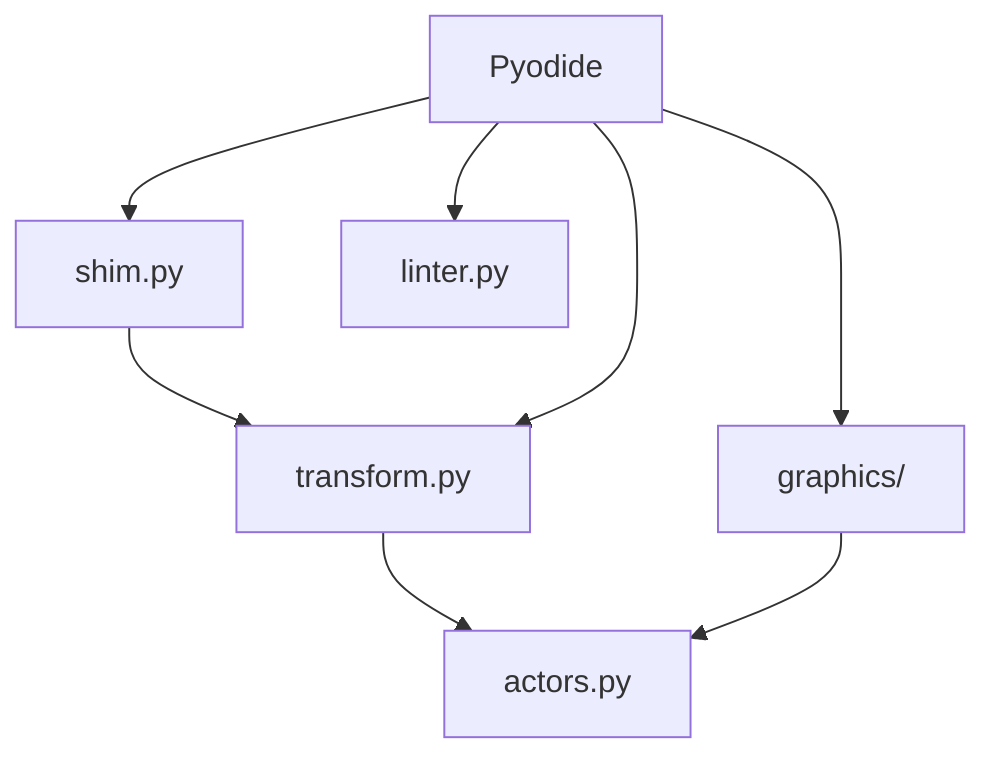

> **Archived — written 2026-04-30. Predates significant codebase changes (API-v1 rework, decomposition, save-flow overhaul, error system, pixel editor). Verify against current code before relying on any detail. [CLAUDE.md](../../CLAUDE.md) is authoritative for architecture notes.**

# Python Assets Specification

**Module:** assets/python, assets/examples
**Files:**
- `src/assets/examples/shim.py`
- `src/assets/examples/transform.py`
- `src/assets/examples/actors.py`
- `src/assets/python/graphics/__init__.py`
- `src/assets/python/graphics/actors/__init__.py`
- `src/assets/python/graphics/actors/config.py`
- `src/assets/python/linter.py`

---

## 1. Overview

Python assets consist of:
- **Compatibility layer** (shim.py) - p5.js-like API for older examples
- **Code transformer** (transform.py) - AST rewriting for state management
- **Actor system** (actors.py) - Legacy actor system for p5 mode
- **New graphics API** (graphics/) - Clean canvas API with Actor system
- **Linter** (linter.py) - Static code analysis

### 1.1 Asset Modules



---

## 2. shim.py (p5 Compatibility)

**File:** `src/assets/examples/shim.py`

### 2.1 Purpose

Provides a p5.js-like API for compatibility with older examples. Used when code has `setup()` and/or `draw()` functions.

### 2.2 Global Variables

```python
width = 300
height = 300
mouseX = 0.0
mouseY = 0.0
pmouseX = 0.0
pmouseY = 0.0
mouseButton = None
key = ""
keyCode = 0
keyIsPressed = False
frameCount = 0
```

### 2.3 Constants

```python
CENTER = "center"
CORNER = "corner"
CORNERS = "corners"
RADIUS = "radius"
LEFT = "left"
RIGHT = "right"
UP = 38
DOWN = 40
ENTER = 13
ESCAPE = 27
BACKSPACE = 8

PI = math.pi
TWO_PI = math.pi * 2
HALF_PI = math.pi / 2
```

### 2.4 Canvas Functions

| Function | Description |
|----------|-------------|
| createCanvas(w, h) | Set canvas dimensions |
| background(r, g, b) | Clear with color |
| fill(r, g, b, a) | Set fill color |
| noFill() | Disable fill |
| stroke(r, g, b, a) | Set stroke color |
| noStroke() | Disable stroke |
| strokeWeight(w) | Set stroke width |
| rect(x, y, w, h, r) | Draw rectangle (with optional corner radius) |
| ellipse(x, y, w, h) | Draw ellipse |
| circle(x, y, d) | Draw circle |
| line(x1, y1, x2, y2) | Draw line |
| point(x, y) | Draw point |
| text(s, x, y) | Draw text |
| textSize(n) | Set font size |
| textAlign(h, v) | Set text alignment |
| push() | Save context |
| pop() | Restore context |
| translate(x, y) | Move origin |
| rotate(angle) | Rotate |
| scale(x, y) | Scale |

### 2.5 Image Functions

| Function | Description |
|----------|-------------|
| loadImage(path) | Load image (returns dict with img/done) |
| image(img, x, y, w, h) | Draw image |
| imageMode(mode) | Set mode (corner/center) |
| rectMode(mode) | Set mode (corner/center) |

### 2.6 Math Functions

```python
random(low, high=None)    # Random float
map(value, start1, stop1, start2, stop2)
constrain(value, low, high)
dist(x1, y1, x2, y2)
sin(a), cos(a), atan2(y, x)
sqrt(n), abs(n), floor(n), ceil(n)
```

### 2.7 Event Functions

```python
keyIsDown(code)  # Check if key code is pressed
```

### 2.8 Initialization

```python
def _ide_init(post_output, post_input):
    """Called once after Pyodide loads."""
    # Set up stdout/stderr
    # Create console for input
    # Import transform module
    # Import actors module
```

### 2.9 Sketch Runner

```python
def _ide_run_p5(canvas, code_str, entry, assets=None):
    """Run a p5-style sketch."""
    _init(canvas)
    ns = {k: v for k, v in globals().items() if not k.startswith("_ide_")}
    exec(compile(code_str, entry, "exec"), ns)
    _run_sketch(ns)
```

### 2.10 Event Injection

```python
def _inject_event(kind, data):
    """Called from worker on mouse/key events."""
    if kind == "mousemove":
        mouseX = float(data.get("x", 0))
        mouseY = float(data.get("y", 0))
        _call_handler("mouseMoved", ...)
    elif kind == "mousedown":
        _call_handler("mousePressed", ...)
    elif kind == "keydown":
        key = data.get("key", "")
        keyCode = int(data.get("keyCode", 0))
        _call_handler("keyPressed", ...)
```

---

## 3. transform.py (AST Transformer)

**File:** `src/assets/examples/transform.py`

### 3.1 Purpose

Transforms Python AST to add reactive state management and async support.

### 3.2 Public API

```python
def transform(code: str, filename: str = "main.py") -> dict:
    """
    Returns: {
        "code": transformed_code,
        "shim": shim_source or None,
        "metadata": {
            "is_p5": bool,
            "needs_async": bool,
            "uses_canvas": bool
        }
    }
    """
```

### 3.3 Detection

```python
def _is_p5_sketch(tree) -> bool:
    """Check if code has setup/draw functions."""

def _has_input_call(tree) -> bool:
    """Check if code uses input() function."""

def _has_setup_decorator(tree) -> bool:
    """Check if any function has @setup decorator."""
```

### 3.4 AST Rewriters

#### _InputRewriter
Rewrites `input(...)` → `await console.ainput(...)` for async support.

#### _ReactiveTransformer
Handles `@use(state_var)` decorator to rewrite bare variable access to `state_var.key`.

### 3.5 Transformation Modes

**Plain Python:**
```python
# Input
print("hello")

# Output (wrapped in MAIN)
def MAIN():
    print("hello")
MAIN()
```

**With input():**
```python
# Input
name = input("Name: ")

# Output
async def MAIN():
    import console
    name = await console.ainput("Name: ")
asyncio.get_event_loop().run_until_complete(MAIN())
```

**p5 Mode:**
```python
# Input (has setup/draw)
def setup():
    createCanvas(400, 400)

# Output
def setup():
    createCanvas(400, 400)
# ... user code unchanged, but _run_sketch called at end
```

---

## 4. actors.py (Legacy Actor System)

**File:** `src/assets/examples/actors.py`

### 4.1 Purpose

Actor system for p5 mode (older examples). Used when code imports `Actor` from `actors` module.

### 4.2 Actor Class

```python
class Actor:
    def __init__(self, x=0, y=0, kind="auto"):
        self.x = x
        self.y = y
        self.kind = kind  # "circle" or "rect"
        self._vx = 0
        self._vy = 0
        self._angle = 0

    def update(self):
        self.x += self._vx
        self.y += self._vy

    def draw(self):
        if self.kind == "circle":
            circle(self.x, self.y, 20)
        else:
            rect(self.x, self.y, 20, 20)

    def point_to(self, x, y):
        self._angle = atan2(y - self.y, x - self.x)

    def move_forward(self, d):
        self.x += cos(self._angle) * d
        self.y += sin(self._angle) * d
```

### 4.3 Helper Functions

```python
collides(a, b)         # Check if two actors collide
point_in(actor, x, y)   # Check if point is in actor
bounce_off_edges(actor, w, h)  # Bounce at edges
wrap_around_edges(actor, w, h) # Wrap around edges
move_towards(actor, tx, ty, speed)  # Move toward target
keep_on_screen(actor, w, h)  # Keep within bounds
```

### 4.4 Constants

```python
CIRCLE = "circle"
RECT = "rect"
AUTO = "auto"
CENTER = "center"
TOPLEFT = "topleft"
```

---

## 5. graphics/ (New Graphics API)

See [Graphics Module Specification](04-graphics-module.md) for details.

---

## 6. linter.py (Python Linter)

See [Linter Specification](07-linter.md) for details.

---

## 7. Module Resolution

### 7.1 Worker Initialization Order

```python
# worker.ts:initPyodide()
p.FS.writeFile("/_shim_p5.py", shim);
p.FS.writeFile("/transform.py", transform);
p.FS.writeFile("/actors.py", actors);
p.FS.writeFile("/graphics/__init__.py", graphicsInit);
p.FS.writeFile("/graphics/actors/__init__.py", graphicsActors);
p.FS.writeFile("/graphics/actors/config.py", graphicsActorsConfig);
p.FS.writeFile("/linter.py", linter);

# Initialize Python side
await p.runPythonAsync(`
    import sys
    sys.path.insert(0, "/")
    import _shim_p5 as _shim
    _shim._ide_init(_ide_post_output, _ide_post_input_request)
    import linter
`);
```

### 7.2 Module Paths

| Module | Path |
|--------|------|
| shim | `/_shim_p5.py` |
| transform | `/transform.py` |
| actors | `/actors.py` |
| graphics | `/graphics/__init__.py` |
| graphics.actors | `/graphics/actors/__init__.py` |
| graphics.actors.config | `/graphics/actors/config.py` |
| linter | `/linter.py` |

---

## 8. Code Execution Flow

### 8.1 Plain Python
```
transform(code) → wrap in MAIN() → exec()
```

### 8.2 p5 Mode
```
has setup/draw? → _run_sketch() → uses shim.py API
```

### 8.3 New Graphics Mode
```
import graphics → g.run() → uses graphics/ API
```

---

## 9. Asset Building

### 9.1 _ide_build_assets

```python
def _ide_build_assets(bitmap_list: list) -> object:
    """
    Convert ImageBitmap list to assets namespace.
    bitmap_list: Python list of (name, ImageBitmap) pairs
    Returns: SimpleNamespace with sprites attribute
    """
    sprites = SimpleNamespace(**{
        strip_ext(name): {"done": True, "img": bitmap}
        for name, bitmap in bitmap_list
    })
    return SimpleNamespace(sprites=sprites)
```

### 9.2 Usage

```python
# In user code
player = Actor(image=assets.sprites.ship, radius=10)
```

---

*End of Python Assets Specification*